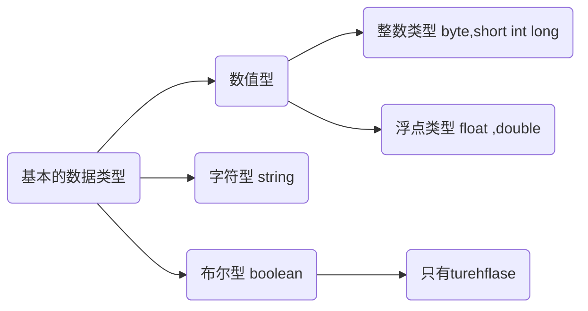

> ✨作者：猫十二懿
>
> ❤️‍🔥账号：[CSDN](https://blog.csdn.net/qq_56098191) 、[掘金](https://juejin.cn/user/3320978695270526) 、[个人博客](https://kongshier.github.io/) 、[Github](https://github.com/kongshier) 
>
> 🎉公众号：猫十二懿


# 基础

## **四种权限修饰符**

大小关系 

~~~java
public >  protected > (default) > private
同一个包	  能访问      能访问 		能访问		能访问
同一个类	  能访问	   能访问	    能访问     不能访问
不同包子类	 能访问	  能访问	   不能访问	  不能访问
不同包非子类  能访问		 不能访问	 不能访问	不能访问
default  并不是关键字 而是根本不写
~~~

## Java的内存需要划分成为5个部分

1.栈(Stack)︰存放的都是方法中的局部变量。方法的运行一定要在栈当中运行。

- 局部变量:方法的参数，或者是方法0内部的变量

- 作用域:一旦超出作用域，立刻从栈内存当中消失。


2.堆(Heap)︰凡是new出来的东西，都在堆当中。

堆内存里面的东西都有一个地址值:16进制堆内存里面的数据，都有默认值。规则:

- int      默认是0；

- float   默认是0.0；

- char    默认是‘\u0000’；

- boolean  默认是false

- 应用类型  默认是null

3.方法区(Method Area):存储.class相关信息，包含方法的信息。

4.本地方法栈(Native Method Stack) :与操作系统相关。

**5.寄存器(pc Register) : 与CPU相关。**

## Sacnner输入 

import java.util.Scanner;	==> 扫描仪:

- 基本语法：Scanner 变量  = new Scanner(System.in);


所以在String written = [input.nextLine]()();		XXX.nexrLINe   XXX须与上面语法变量同名	

```java

import java.util.Scanner;
public class impots {
    public static void main(String [] args)
    {
        System.out.print("输入");
        Scanner input = new Scanner(System.in);
        String written = input.nextLine();		//nexttlnt输入整形数

        System.out.println("输入的数据："+written);
    }
}
//		System input = new Scanner(System.in)  分配内存
//		String output = input.nextDoble();		nextDoble输入有小数的数
//		Stirng output = input.netx();			next输入字符串
```

### 输入的类型

- 如果扫描整数：使用input.nextInt();

- 如果扫描小数：使用input.nextDouble();
- 如果扫描字符串：使用input.next();

### 输出：

- System.out.println(); // 这是输出后换行
- System.out.print(); //这是输出后不换行
- System.out.printf(); //格式化输出

##  基本机构

### 1形式

~~~java
public  class   类名（文件名）{
  public static  void mian (String  args []){
  	System.out.println(“要输出的内容”);
}
~~~

- 集合

  Map：HashMap（最重要）、ConcurrentHashMap、TreeMap、Hashtable

  List：ArrayList（最重要）、LinkedList

  Set：HashSet（最重要）、TreeSet

以上的结构是没有从键盘输入的的代码

### 2从键盘输入的代码

注意import java ,util ...这一行的代码来控制25行出的键盘输入内容

```java
import java.util.Scanner;//导入 java.util 包下的 Scanner 类,用来构建Scanner对象
public class Main{
    public static void main(String[] args)
    {
        Scanner scanner = new Scanner(System.in);//建立Scanner对象，通过System.in来读取键盘输入数据
        System.out.println("请输入你的名字：");
        String name = scanner.nextLine();//字符串输入语句名字name
        System.out.println("请输入你的爱好：");
        String favor = scanner.nextLine();//字符串输入语句爱好favor
        System.out.println("请输入你的年龄：");
        int age = scanner.nextInt();//整型输入年龄age
        System.out.println("==============输出如下结果=============");
        System.out.println("我的名字："+name);//输出名字name
        System.out.println("我的爱好："+favor);
        System.out.println("我的年龄："+age);
    }
}
```


### 3数据类型



## 三目运算符

### 1、语法规则：

布尔表达式？表达式1：表达式2

### 2三元运算符的执行原理：

若为ture则选择表达式1的结果作为执行结果；

否则（false）选择表达式2的结果作为执行结果。

- if语句的四种编写方式

#### 第一种

~~~java
if(表达式){
   java语句;
}
~~~

#### 第二种

~~~java
if(表达式){
   java语句;
} else {    
Java语句;
}
~~~

#### 第三种

~~~java
if(判断表达式){
  Java代码
}else if(判断表达式){
  Java代码
}
~~~

对于Java中的 if 语句来说，只要有一个分支执行，整个id语句全部结束

#### 4.第四种

~~~java
if(条件一){
  
}
if(条件二){
  
}
~~~

# 字符串

特点：

- 1.字符串的内容永不可变。【重点】
- 2.正是因为字符串不可改变，所以字符串是可以共享使用的。
- 3**.字符串效果上相当于char[]字符数组，但是底层原理是byte[]字节数组**

**创建字符串**：3+1 种方法

三种构造方法：

- public String（）：创建一个空白字符串，不含有任何内容
- public String（cahr[] array）:根据字符数组的内容，来创建对应的字符串。
- public String（byte[] array）根据字节数组的内容，来创建对应的字符串。  
- 直接创建：String str = “   ”；

**字符串常量池**

1.对于引用类型来说,==进行的是地址值的比较。

2.双引号直接写的字符串在常量池当中,new的不在池当中。

## 字符串方法

### 字符串比较

```java
* ==是进行对象的地址值比较，如果确实需要字符串的内容比较，可以使用两个方法
* public boolean equals(Object obj)//参数可以是任何对象，只有参数是一个字符串并且内容相同
*注意实现：
*1：任何都可以用Object进行接受
*2. equals方法具有对称性，也就是a.equals(b)和b.equals(a)效果一样。
*3．如果比较双方一个常量一个变量，推荐把常量字符串写在前面。
 推荐:“abc".equals(str)不推荐:str.equals( ""abc"")
* public boolean equalsIgnoreCase(String str)。忽略大小写，进行内容比较。
```

### 字符串获取

```java
* String当中与获取相关的常用方法有:
* public int length():获取字符串当中含有的字符个数，拿到字符串长度。
* public String concat(String str):将当前字符串和参数字符串拼接成为返回值新的字符串。
 * public char charAt(int index):获取指定索引位置的单个字符。（索引从o开始。)
 * public int indexOf(String str):查找参数字符串在本字符串当中首次出现的索引位置，如果没有返回-1值。
```

### 字符串截取

```java
* public String substring(int index):截取从参数位置一直到字符串末尾，返回新字符串。
* public String substring(int begin，int end):截取从begin开始，一直到end结束，中间的字符串。
 备注:[ begin, end)，包含左边，不包含右边。
```

### 字符串转换

```java
String当中与转换相关的常用方法有:
* public char[ ] toCharArray():将当前字符串拆分成为字符数组作为返回值。
* public byte[] getBytes():获得当前字符串底层的字节数组。
* public String replace(CharSequence oldString,CharSequence newString ):
 将所有出现的老字符串替换成为新的字符串，返回替换之后的结果新字符串。
```

### 分割字符串

```java
分割字符串的方法:
public String[ ] split(String regex):按照参数的规则，将字符串切分成为若干部分。
注意事项:
split方法的参数其实是一个“正则表达式”。要注意:如果按照英文句点”.”进行切分，必须写  \\.  (两个反斜杠)
```

## String类

### 格式化

import java.util.Date;导入类      

#### 1日期格式化

```java
//日期格式化
import java.util.Date ;//导入java.util.Date
public class Main                     			//这里的类Main都一样，新建则要一样
{
    public static void main(String[] args)  	//主方法
    {
        Date date =new Date();					//创建Date对象的data
        String year=String.format("%tY",date);	//%tY是4位数的年份（即多少年）
        String month=String.format("%tB",date);	//%tB是指定语言环境的月份全程（即多少月：“月”单位也带上，则输出时不用+月）
        String day=String.format("%td",date);	//%td是值一个月中的第几天01~31号
        System.out.println("今年是："+year+"年");
        System.out.println("现在是："+month+);
        System.out.println("今年是："+day+"号");
    }

}
```

#### 2时间格式化

```java
//时间格式化
import java.util.Date;
public class Main
{
    public static void main(String[] args)
    {
        Date date=new Date();
        String hour = String.format("%tH",date);			//%tH是0~23小时    同时对data格式化
        String minute = String.format("%tM",date);			//%tM是00~60秒
        String second = String.format("%tS",date);			//%tS是00~59分
        System.out.println("现在是"+hour+"时"+second+"分"+minute+"秒");
    }
}
```

#### 3常规格式化

```java
public class Main
{
    public static void main(String[] args)
    {
        String str = String.format("%d",400/2);             //将十六进制数格式显示
        String str2 = String.format("%b",3>5);              //将结果以boolean型显示
        String str3 = String.format("%x",200);              //将结果以十六进制格式显示
        System .out .println("400的一半是："+str);            //输出格式化字符串
        System.out.println("3>5正确吗："+str2);
        System.out.println("200的十六进制数是："+str3);
    }
}
```


## 字符生成器

### 1字符生成器

```java
public class Main {
    public static void main(String[] args)
    {
        String str = "";                                    //创建空字符
                    //定义对字符串执行的操作的起始时间
        long starTime =System.currentTimeMillis();
        for (int i = 0;i<10000;i++)                         //利用fou循环执行10000次操作
        {
            str = str+i;                                    //循环追加字符串
        }
        long endTime = System.currentTimeMillis();          //定义对字符串操作后的时间
        long time = endTime-starTime;                       //计算对字符串执行操作的时间
        System.out.println("String消费时间:"+time);           //输出执行的时间
        StringBuilder builder = new StringBuilder("sacacac");//创建字符生成器

        //1  append()追加字符


        //2   insert(int ofset ,arg)                    增加字符至生成器,即插入字符
        StringBuilder bf = new StringBuilder("hello");      //创建字符生成器
        bf.insert(5,"world");                     //添加至字符生成器的内容
        System.out.println(bf.toString());                  //输出helloworld信息:toStrings是输出bf的合成内容


        //3  delete(int star,int end)
        StringBuilder babf = new StringBuilder("StringBuilder");
        babf.delete(5,7);                                       //删除5~7的字符 ，从0开始  即g、B、u。
        System.out.println(babf.toString());                    //输出Strinilder


        starTime = System.currentTimeMillis();              //定义对字符串操作前的时间
        for (int j=0;j<10000;j++)                           //利用for循环进行操作
        {
            builder.append(j);                              //循环追加字符
        }
        endTime = System.currentTimeMillis();               //定义操作后的时间
        time = endTime-starTime;                            //追加操作的时间差
        System.out.println("StringBuilder消耗时间："+time);   //输出操作时间
    }
}
```


StringBuilder初始容量的16个字符可自行指定初始长度

若超过StringBuilder容纳长度，StringBuilder会自动增加长度容纳被附加的字符

若用StringBuilder输出最后的字符结果，可使用toString()方法：如上面代码 2 和3

### 2.产生一个随机数：

1、找到一个有随机数产生器的商店，语法：import java.util.Random;

2、购买一台随机数产生器并取一个名字，语法：Random ran = new Random();

3、使用这台随机数产生器的功能区产生随机数，语法：ran.nextInt(数字);

ran.nextInt(10) 表示产生一个0~9之间的随机数

ran.nextInt(10) +1表示产生一个1~10之间的随机数

## StringBuilder

**StringBuilder和String  的区别**：

- String ： 内容是不可改变的
- StringBuilder：内容是可改变的

### StringBuilder构造方法

|              方法名              |                    说明                    |
| :------------------------------: | :----------------------------------------: |
|      public StringBuilder0       | 创建一个空白可变字符串对象，不含有任何内容 |
| public StringBuilder(String str) |   根据字符串的内容，来创建可变字符串对象   |


### StringBuilder添加、反转


|                方法名                 |                说明                |
| :-----------------------------------: | :--------------------------------: |
| public StringBuilder append(任意类型) | 添加：    添加数据，并返回对象本身 |
|    public StringBuilder reverse()     |  反转：        放回相关的字符序列  |


# 数组

## 1一维的创建和初始化

- 数组长度：数组名称.length。运行期间，长度不可以改变

### 初始化方式（3种）

1. 动态初始化（指定长度）

  动态初始化数组的格式：

  ~~~java
  数据类型[]  数组名称   =   new 数据类型 [数据长度]
  int[] array = new int[10];
  ~~~

  //左右两侧的数据类型要一致

2. 静态初始化（指定内容）

  格式：数据类型【】 数组名称   =   new    数据类型【】{…..,  …. ,  …..,元素n } 

  ~~~java
  int[] array = {1,2,3,34};
  ~~~

3. 匿名数组适用于直接向方法传输参数

  ~~~java
  String []test2 = new String[]{"1","23","456"};
  ~~~

  

### 1.1一维创建

#### 1.1.1先声明，再分配内存

数组元素类型 数组名字[]；

数组元素类型[] 数组名字；

##### **声明一维数组**

```java
int[] a;
String[] str;
```

##### **分配内存**：数组名字 = new 数组元素类型 [数组元素的个数]；

```java
new int[2];
```

分配内存。

#### 1.1.2声明并分配内存

数组元素类型 数组名  =  new 数组元素的类型  [数组元素的个数]；

实例代码：

```java
int month = new int [45];
```

### 1.2一维数组初始化

数组的初始化可数组的初始化有以下两种形式：

#### 1.2.1初始化

```java
int[] arrx = new int[]{1,2,3,5,25}; //第一种初始化方式
int[] arr2 = {34,23,12,6}; //第二种初始化方式
```

### 1.3一维数组简单使用：

```java
public class Main {
    public static void main(String[] args)
    {
        //创建一维数组并初始化
        int[] day = new int[]{31,28,31,30,31,30,31,31,30,31,30,31};
        for (int i = 1;i < 12;i++)
        {
            System.out.println((i+1)+"月有"+day[i]+"天");
        }
    }
}
```

## 2二维数组的创建和初始化

### 2.1二维数组创建

```java
数组元素类型 数组名字[][]；
数组元素类型[][] 数组名字；
```

#### 2.1.1二维数组先声明，再分配内存

```java
int[][] arr;
arr = new int[1][4];
int [][] a;
a = new int[2][];
a[0] = new int[2];
a[1] = new int [3];
```

#### 2.1.2二维数组声明并分配内存

```java
int arr = new int[45][45];
```

### 2.2二维数组初始化

#### 2.2.1二维数组初始化

```java
tyde arrayneme [][]= { value1,value2,......value n} ;
```

```java
int myarr [][] = {{1,2},{4,5}}; 
```

### 2.3使用二维数组

#### 2.3.1二维数组的简单使用

```java
public class Main {
    public static void main(String[] args)
    {
        //int a[][] = new int[3][4];
        int[][] a = {{1,2,3},{4,5,6},{7,8,9}};
        for (int i = 0;i<a.length;i++)            //a.length表示行数
        {
            for (int j = 0;j<a[i].length;j++)   //a[i].length表示所在行的长度
            {
                System.out.print("    "+a[i][j]);
            }
            System.out.println();
        }
    }

}
```

运行结果：

```java
1    2    3
4    5    6
7    8    9
```

## 3遍历数组

#### 3.1   for循环

```java
public class Main {
    public static void main(String[] args)
    {
        int[][] b = new int[][]{{1},{2,3},{4,5,6}};//二维数组
        for (int i=0;i<b.length;i++)
        {
            for (int j=0;j<b[i].length;j++) {//循环遍历二维数组中的每个元素

                System.out.print(b[i][j]);
            }
            System.out.println();
        }
    }
}
```

遍历结果：

1
23
456


#### 3.2  for each语句

```java
    for (元素变量x∶遍历对象obj){
    引用了x的java语句;
}
```

##### 3.2.1   for each遍历

```java
public class Main {
    public static void main(String[] args)
    {
     int[][] arr = {{4,3},{12,45}};
     System.out.println("数组中的元素是：");
     int i=0;
     for (int x[]:arr)                          //外循环变量一维数组
     {
         i++;                                   //外层计数器递增
         int j=0;                               //内层循环计数器
         for(int e:x)                           //内循环遍历每一个数组元素
         {
             j++;                               //内层计数器递增
             if(i == arr.length && j==x.length) //判断变量是二维数组中的最后一个元素
             {
                 System.out.print(e);           //输出二维数组的最后一个元素
             }
             else
             {
                 System.out.print(e+"、");       //输出信息
             }
         }
     }
    }
}
```

## 4填充替换数组元素

```java
import java.util.Arrays;  //导包
```

导入类

### 4.1替换填充二维数组元素

```java
方法一:
 fill(int [] a,int value);   
方法二：
fill(int[] a,int formIndex,int toIndex,int vlaue);  

a：要填充的数组
value:要存储在数组中的元素；
formIndex： 填充的第一个元素索引（包括）
toIndex:    填充的最后一个元素所以（不包括）
```


方法一：

fill(int [] a,int value);

```java
import java.util.Arrays;
public class Main {
    public static void main(String[] args)
    {
        int[] arr = new int [5];
        Arrays.fill(arr,8);                 //使用同一个值对数组进行填充
        for (int i = 0;i<arr.length;i++)
        {
            //将数组中的元素依次输出
            System.out.println("第"+i+"个元素是："+arr[i]);
        }
    }
}
```


方法二：

fill(int[] a,int formIndex,int toIndex,int vlaue); 

```java
import java.util.Arrays;
public class Main {
    public static void main(String[] args)
    {
        int[]  arr = new int []{45,12,56,53};
        Arrays.fill(arr,1,2,8);                 //使用fill对数组进行初始化
        for (int i = 0;i<arr.length;i++)
        {
            System.out.println("第"+i+"个元素是："+arr[i]);           //将数组中的元素依次输出
        }
    }
}
```

### 4.2对数组进行排序

运用方法：Arrays.sort(arr)

要引用import  java.util.arrays头文件

Arrays.sort(object)

```java
import java.util.Arrays;
public class Main {
    public static void main(String[] args)
    {
        int[] arr = new int []{45,78,10,63};
        Arrays.sort(arr);                                       //将数组进行排序
        for (int i = 0;i<arr.length;i++)                        //循环遍历排序后的数组
        {
            System.out.println(arr[i]);           //将数组中的元素依次输出
        }
    }
}
```

### 4.3  复制数组

方法一：

copyOf ( arr  ,  intnewlength)

intnewlength  :  新数组长度 

```java
import java.util.Arrays;
public class Main {
    public static void main(String[] args)
    {
        int[] arr = new int[]{3,2,4};                   //定义二维数组
        int newarr[] = Arrays.copyOf(arr,5);  //复制数组
        for (int i = 0;i<arr.length;i++)                //循环遍历后的新数组
        {
            System.out.println(newarr[i]);              //输出新数组
        }
    }
}
```

方法二：

copyofRange (arr , int formIndex , int toIndex)

formIndex :包括

toIndex：不包括 ； 可大于arr长度

```java
import java.util.Arrays;
public class Main {
    public static void main(String[] args)
    {
        int[] arr = new int[]{3,2,4,45,52,888,6666};                     //定义二维数组
        int[] newarr = Arrays.copyOfRange(arr,4,5);             //复制数组
        for (int i = 0;i<arr.length;i++)                                //循环遍历后的新数组
        {
            System.out.println(newarr[i]);                              //输出新数组
        }
    }
}
```

结果为：52

从0开始数数组元素

## 5数组查询

方法一：

binarySearch(Object[] , Object key)

key : 要搜索的值。

```java
import java.util.Arrays;
public class Main {
    public static void main(String[] args)
    {
        int[] a = new int[]{1,2,4,8,56,456};
        Arrays.sort(a);
        int index = Arrays.binarySearch(a,2);
        System.out.println("2的索引位置是："+index);
    }
}
```

方法二：

```java
binarySearch(Object[],int formIndex,int toIndex,Object key);
```

formIndex ：索引开始位置（包括）

toIndex ： 索引结束位置（不包括）

```java
import java.util.Arrays;
public class Main {
    public static void main(String[] args)
    {
        //int a[] = new int[]{1,2,4,8,56,456};
        String[] str = new String[]{"ab","sc","ad","cd","abd"};
        Arrays.sort(str);
        int index = Arrays.binarySearch(str,0,5,"cd");
        System.out.println("cd的索引位置是："+index);
    }
}
```

### 5.1冒泡排序：

### 5.2直接选择排序

```java
//直接选择排序发
public class SelectSort {
    public static void main(String[] args)
    {
        int[] array = {63,45,78,66,55,1};//创建一个乱序的数组
        SelectSort sorter = new SelectSort();
        sorter.sort(array); //将数组进行排序
    }

    public void sort(int[] array)
    {
        int index;      //做记录
        for (int i = 1;i<array.length;i++)
        {
            index = 0;
            for(int j = 0;j<array.length-i;j++)
            {
                if(array[j]>array[index])
                {
                    index = j;
                }
            }
            //交换在位置array.length-i和index（最大值)上的两个数
            int temp = array[array.length-i];
            array[array.length-i] = array[index];
            array[index] = temp;
        }
        showArray(array);   //输出直接选择排序后的数组元素
    }

        //要显示的数组
    public void showArray(int[] array)
    {
        for (int i:array)   //遍历数组
        {
           System.out.print(+i);//输出每个数组的元素
        }
        System.out.print();
    }
}
```

### 5.2反转排序

```java
//反转排序
public class reverSort {
    public static void main(String[] args)
    {
        int[] array = {23,45,78,1,56,55};
        reverSort sorter = new reverSort();
        sorter.sort(array);//调用排序对象的方法，将数组反转
    }
    public void sort(int[] array)
    {
        System.out.println("反转前数组：");
        showArray(array);
        int temp;
        int len = array.length;
        for(int i = 0; i<len/2;i++)//比较一半
        {
            temp = array[i];
            array[i] = array[len - 1- i];//最后一个和第一个交换
            array[len - 1 - i] = temp;
        }
        System.out.println("反转后的数组：");
        showArray(array);
    }
    public void showArray(int[] array){
        for (int i :array)
        {
            System.out.print("    "+i);
        }
        System.out.println();
    }

}
```

# 类和对象

**1.OO:Object Oriented表示面向对象的意思**

- **属性（成员变量）：**就是对象所具有特征
- **行为（成员方法）：**该事事物能做什么

publid void eat()   //没有static，并且不写在main方法中

- **方法**：就是对象所执行的行为或操作
- **对象**：用来描述真实存在事物的一个实体，由一组属性和方法组成
- **封装**：对象的属性和方法通常封装在一起，共同体现事物的特性，两者不可分割

**类和对象的关系**：

- **类是**对一类事物的描述：是**抽象**的
- **对象**的一类事物的实例：是**具体**的
- 类是对象的模板，对象是类的实体

**类**：包括对象的属性和方法

- **4.定义一个类的步骤：**
- 1、新建一个class，给这个class取一个类名，名字和你想要定义的类型一致类名的取名方式，使用帕斯卡命名法，所有单词的首字母大写
  2、定义类的属性
  3、定义类的方法

1. 通常情况下，一个类不能直接使用，需要根据类创建一个对象，才能使用

- 导包：也就是指出需要的类的位置

  import    包名称 ，类名称；

  对于当前的类属于同一个包的情况，可以省略导包语句不写

- 创建。格式：

  类名称 对象名  =  new 类名称（）；

- 使用。分两种情况：

  使用成员变量 ：对象名 .  成员变量名 ;

  使用成员方法：对象名  .  成员方法名（参数）;

- **局部变量和成员变量**

  

- 

**5.使用定义好的类：**
1、新建一个对象，语法：类名 对象名 = new 类名();
比如：Car car1 = new Car();
2、通过“.”操作符来使用这个对象的属性和方法

## 1.类库

我们自定义的类：开头的类名

Java中自带的类库：例如String、System.class；这些类都是标识符。只要是类名都是标识符，

### 内部类

一个类内部还有包含有一个类，则为内部类

分类：

- 1 成员内部类
- 2 局部内部类（包含匿名内部类）

成员内部类定义格式：

~~~java
修饰符 class 外部类名称{
    修饰符 class 内部类名称{
        //方法体
    }
}
~~~

**使用方式**

~~~java
1.间接使用 在外部类的方法中，使用内部类，然后main知识调用外部类的方法
2.直接方法 :类名称 对象名 = new 类名称（）；外部类名称.内部类名称 对象名 = new  外部类名称().new 内部类名称();
~~~

**重名现象**

- 格式： 外部类名称. this .外部类成员变量名

**局部内部类**

~~~~java
修饰符 class 外部类名称{
       修饰符  放回值类型 外部类名称（）{
           class 局部内部类名称{
           }
       }
}
~~~~


## 2:面向对象

面向过程：当需要实现一个功能的时候，每一个具体的步骤，详细到每一个细节     **强调步骤**

面向对象：当需要实现一个功能的时候，找到实现功能的程序     **强调对象**

- 三大特征：封装、继承、多态

### 封装：

```java
1：方法就是一种方法
2:关键字private也是一种封装
封装就是将一些信息隐藏起来，对外界不可见
```

```java
间接访问privata成员变量，就是定义一对Getter（输出）/Steer（输入）方法
必须是steXxx（参数）或者是getXxx（无参数）
Getter（）：返回值类型和成员变量对应
Setter（参数）：参数类型和成员变量对应
```


### **继承**

**三个继承特点：**

- 1.Java语言是单继承的。一个类的直接父类只能有唯一一个。
- 2.Java语言可以多级继承。我有一个父亲，我父亲还有一个父亲，也就是爷爷。
- 3.一个子类的直接父类是唯一的，但是一个父类可以拥有很多个子类。可以有很多个兄弟姐妹，生二胎。

在继承的关系中，“子类就是一个父类”。也就是说，子类可以被当做父类看待。例如父类是员工，子类是讲师，那么“讲师就是一个员工”。关系: is-ao

```java
定义父类的格式:(一个普通的类定义)
public class父类名称{
    //...
}

定义子类的格式:
public class子类名称  extends  父类名称{  
    // ...
}
```

#### 继承关系中，父子类构造方法的访问特点:

1. 子类构造方法当中有一个默认隐含的*“super()"*调用，所以一定是先调用的父类构造，后执行的子类构造。

2. 子类构造可以通过super关键字来调用父类重载构造。

3. super的父类构造调用，必须是子类构造方法的第一个语句。不能一个子类构造调用多次super构造

4. 总结:

   子类必须调用父类构造方法，不写则赠送super()﹔写了则用写的指定的super调用，super只能有一,还必须是第一个。

   

   **super关键字的用法有三种:**

   1．在子类的成员方法中，访问父类的成员变量。

   2．在子类的成员方法中，访问父类的成员方法。

   3．在子类的构造方法中，访问父类的构造方法。

   

- This

  通过谁调用的方法，谁就是this

  

super关键字用来访问父类内容，而this关键字用来访问本类内容。用法也有三种:

- 1．在本类的成员方法中,访问本类的成员变量。
- 2．在本类的成员方法中，访问本类的另一个成员方法。
- 3.在本类的构造方法中,访问本类的另一个构造方法。

**在第三种用法当中要注意:**

A. this ( ...)调用也必须是构造方法的第一个语句，唯—一个。

B. super和this两种构造调用，不能同时使用。

~~~java
public class fu{
    int num = 10;
    method(){};//父类
}
//两个类

Zi extends fu{
    int num = 20;
    method(){}//子
    show(){
        int num = 30;
        sout(num);//30
        sout(this.num)//20
        sout(super.num)//3        sout(super.num)//30
    }
}

	//main方法
    Dome{
        psvm{
            Zi zi = new zi();
            zi.shou();
            zi.method();
        }
    }
}
~~~

### 多态

```java
* 代码 当中体现多态性：父类引用执行子类对象
* 格式：
* 父类名称 对象名 = new 子类名称（）;
*
*或者
* 接口名称 对象名 = new 实现类名称（）;
*
```

多态不能访问子类的独有功能   通过类型的转换可以访问子类的功能 

子到夫  ：子类对象赋值给父类类型的变量指向

**对象的向上转型**

~~~java
1.对象的向上转型，其实就是多态写法:
格式:父类名称对象名= new 子类名称O;
含义:右侧创建一个子类对象，把它当做父类来看待使用。
注意事项:向上转型一定是安全的。从小范围转向了大范围。
    列如  Animal animal = new CatO;
	//创建了一只猫，当做动物看待，没问题。
~~~


**对象的向下转型**   其实就是**还原**动作

~~~java
/*
格式：子类名称 对象名 = new 父类名称（）;
涵义 将父类对象 【还原】成为本来的子类对象

*/

Animal animal= new Cat（）;//本来是猫 向上转型为动物
Cat cat = （Cat）animal;//本来是猫，已经被当做动物了，还原回来成为本来的猫
/*注意事项:
a.必须保证对象本来创建的时候，就是猫，才能向下转型成为描。
b.如果对象创建的时候本来不是猫，现在非要向下转型成为猫，就会报错。ClassCastException
*/
~~~


### 构造方法：

​      是专门用来创建对象的方法，当我们通过关键字new来创建对象时，其实就是调用构造方法

- **构造方法格式：public 类名称（参数类型  参数名称）{方法体}**

注意：

1：构造方方法的名称必须和所在的类名称完全一样，大小写也要一样

2：构造方法不要写返回值类型，连void的也不要写

3：不能return一个具体的返回值

4：如果编写任何构造方法，那么编译器就会默认赠送一个构造方法，没有参数，方法体什么都不做

5：一旦编写了只要一个构造方法，那么编译器不赠送构造方法‘

6：构造方法也可以进行重载。 

- **匿名对象：**

  只有右边的对象，没有左边的名字和 赋值运算符

  格式：new 类名称();

  **只能使用一次**，再次使用需要创建新对象

- 匿名对象作为参数和返回值


## Lanbanda

- Lambda允许把函数作为一个方法的参数，使用Lambda表达式可以写出更简洁、更灵活的代码

1. lambda表达式语法

   Lambda表达式在Java语言中引入了一个操作符**“->”**，该操作符被称为Lambda操作符或箭头操作符。它将Lambda分为两个部分：

   - 左侧：指定了Lambda表达式需要的所有参数
   - 右侧：制定了Lambda体，即Lambda表达式要执行的功能。

   ~~~java
           //语法格式一  无参 无返回值  lambda 只需一条语句
           Runnable runnable = () -> System.out.println("Runnable 运行了！！");
           runnable.run(); //run是Runnable的方法
   
   
           //语法格式二  一个参数 无返回值
            Consumer<String> consumer =(x) -> System.out.println(x);
           consumer.accept("运行了？？？？");*/  //consumer 的 accept
   
   //        语法格式三   有一个参数 参数括号可以省略
           Consumer<String> consumer = x -> System.out.println(x);
           consumer.accept("运行了？？？？");
   
   
   //        语法格式四  有两个参数 并且里面有多条语句
   	       Comparator<Integer> com = (x , y) ->{
              System.out.println("函数式接口！");
              return Integer.compare(x,y);
              };
   	        System.out.println(com.compare(45,1));  //x<y 输出-1  x = y 输出 0  x > y 输出 1
   
   //        //语法格式五 有两个参数以上有返回值 lambada 只有一个语句 return 和大括号都可以省略不写
           Comparator<Integer> com = (x, y) -> Integer.compare(x, y);
           System.out.println(com.compare(12,45));//输出-1
   
           //语法格式六 lambda参数列表可以省略不写 JVM会进行”类型推断“
           Comparator<Integer> com = (Integer x, Integer y) -> Integer.compare(x, y);
           System.out.println(com.compare(12,45)); //-1
   
           //  左右遇一括号省，左侧推断类型省，能省则省
   
   ~~~


省略规则：

- 参数类型可以省略不写。  就是上面的格式一
- 如果只有一个参数，参数类型可以省略，同时()也可以省略。
- 如果Lambda表达式的方法体代码只有一行代码。可以省略大括号不写,同时要省略分号!
- 如果Lambda表达式的方法体代码只有一行代码。可以省略大括号不写。此时，如果这行代码是return语句，必须省略return不写，同时也必须省略";"不写

### 函数式接口

- 只包含一个**抽象方法**的接口，就称为函数式接口。我们可以通过Lambda表达式来创建该接口的实现对象。

  @FunctionalInterface注解  检测它是不是一个函数式接口

  ~~~java
  //一个函数式接口
  @FunctionalInterface
  interface Run{
      void run();//只有一个抽象方法
  }
  
  public static void Sport(Run r){
      System.out.println("开始");
      r.run();//参数构造
       System.out.println("结束");
  }
  
  Run run = ()->{ System.out.println("运动员跑");};
   System.out.println("-----------------");
  
  
  Sport(()->{System.out.println("运动员准备跑");});
  
  ~~~
  
  
  
  

~~~java
    //自定义一个函数式接口
    @FunctionalInterface
    public interface  MyFuncInterf<T>{
        public T getValue(String origin);
    }

    //定义一个方法 讲函数式接口作为方法参数
    public String toLowerString(MyFuncInterf<String> mf,String origin){
        return mf.getValue(origin);
    }

    //将Lambda表达式实现的接口作为参数传递
    public void test01(){
        String value = toLowerString((str) ->{
            return str.toLowerCase();
        },"abc");
        System.out.println(value);
    }
~~~

- java内置函数式接口

  四大核心函数式接口

|       函数式接口        | 参数类型 | 返回类型 |                             用途                             |
| :---------------------: | :------: | :------: | :----------------------------------------------------------: |
| Consumer<T>消费类型接口 |    T     |   void   |       对类型为T的对象应用操作，包含方法：void  accpt()       |
|  Suppiler<T>函数式接口  |    无    |    R     |             放回类型为T的对象 ，包含方法 T:get()             |
|      Function<T,R>      |    T     |    R     | 对类型为T的对象应用操作并返回结果。结果是R类型的对象。包含方法：R apply（T t） |
| Predicate<T>断定型接口  |    T     | boolean  | 确定类型为T 的对象是否满足某约束条件，并返回boolean值包含方法：boolean test (T t) |

# IDEA

## 1、快捷键

###  Crtl

| Ctrl +F            | 在当前文件进行文本查找(必备〉                                |
| ------------------ | ------------------------------------------------------------ |
| **Ctrl +R**        | **在当前文件进行文本替换(必备）**                            |
| **Ctrl +Z**        | **撤销（必备)**                                              |
| **Ctrl +Y**        | **删除光标所在行或删除选中的行（必备）**                     |
| Ctrl +X            | 剪切光标所在行或剪切选择内容                                 |
| **Ctrl+ D**        | **复制光标所在行或复制选择内容，并把复制内容插入光标位置下面（必备）** |
| **Ctrl + w**       | **递进式选择代码块。可选中光标所在的单词或段落，连续按会在原有选中的基础上再扩展选中范围（必备)** |
| Ctrl +E            | 显示最近打开的文件记录列表                                   |
| Ctrl +N            | 显示最近打开的文件记录列表                                   |
| Ctrl+ G            | 在当前文件跳转到指定行处                                     |
| Ctrl +J            | 插入自定义动态代码模板                                       |
| **Ctrl +P**        | **方法参数提示显示**（光标放到小括号里面）                   |
| **Ctrl + Q**       | **光标所在的变量/类名/方法名等上面(也可以在提示补充的时候按)，显示文档内**容 |
| **Ctrl +U**        | **前往当前光标所在的方法的父类的方法/接口定**义              |
| **Ctrl+B**         | **进入光标所在的方法/变量的接口或是定义出，等效于Ctrl +左键单击** |
| Ctrl + K           | 版本控制提交项目，需要此项目有加入到版本控制才可用           |
| Ctrl +T            | 版本控制更新项目，需要此项目有加入到版本控制才可用           |
| Ctrl+H             | 显示当前类的层次结构                                         |
| Ctrl+ O            | 选择可重写的方法                                             |
| Ctrl+l             | 选择可继承的方法                                             |
| Ctrl++             | 展开代码                                                     |
| Ctrl+ -            | 折叠代码                                                     |
| **Ctrl+ /**        | **注释光标所在行代码，会根据当前不同文件类型使用不同的注释符号（必备）** |
| Ctrl +[            | 移动光标到当前所在代码的花括号开始位置                       |
| ctrl + ]           | 移动光标到当前所在代码的花括号结束位置                       |
| **Ctrl + F1**      | **在光标所在的错误代码出显示错误信息**                       |
| Ctrl +F3           | 调转到所选中的词的下一个引用位置                             |
| Ctrl+ F4           | 关闭当前编辑文件                                             |
| Ctrl +F8           | 在Debug模式下，设置光标当前行为断点，如果当前已经是断点则去掉断点 |
| Ctrl + F9          | 执行Make Project操作                                         |
| Ctrl +F11          | 选中文件/文件夹，使用助记符设定/取消书签                     |
| Ctrl +F12          | 弹出当前文件结构层，可以在弹出的层上直接输入，进行筛选       |
| Ctrl + Tab         | 编辑窗口切换，如果在切换的过程又加按上delete，则是关闭对应选中的窗口 |
| Ctrl + Enter       | 智能分隔行                                                   |
| Ctrl + End         | 跳到文件尾                                                   |
| Ctrl + Home        | 跳到文件头                                                   |
| **Ctrl + Space**   | **基础代码补全，默认在Windows系统上被输入法占用，需要进行修改，建议修改为Ctrl +逗号（必备)** |
| Ctrl + Delete      | 删除光标后面的单词或是中文句                                 |
| Ctrl+ BackSpace    | 删除光标前面的单词或是中文句                                 |
| Ctrl+ 1,2,3...9    | 定位到对应数值的书签位置                                     |
| Ctrl+左键单击      | 在打开的文件标题上，弹出该文件路径                           |
| **Ctrl＋光标定位** | **按Ctrl不要松开，会显示光标所在的类信息摘要**               |
| Ctrl+左方向键      | 光标跳转到当前单词/中文句的左侧开头位置                      |
| Ctrl+右方向键      | 光标跳转到当前单词/中文句的右侧开头位置                      |
| Ctrl+前方向键      | 等效于鼠标滚轮向前效果                                       |
| Ctrl+后方向键      | 等效于鼠标滚轮向后效果                                       |

### Alt

| Alt+`            | 显示版本控制常用操作菜单弹出层                               |
| ---------------- | ------------------------------------------------------------ |
| Alt+ Q           | 弹出一个提示，显示当前类的声明/上下文信息                    |
| Alt+ F1          | 显示当前文件选择目标弹出层，弹出层中有很多目标可以进行选择   |
| Alt +F2          | 对于前面页面，显示各类浏览器打开目标选择弹出层               |
| Alt + F3         | 选中文本，逐个往下查找相同文本，并高亮显示                   |
| Alt + F7         | 查找光标所在的方法Ⅰ变量/类被调用的地方                       |
| Alt+F8           | 在Debug的状态下，选中对象，弹出可输入计算表达式调试框，查看该输入内容的调试结果 |
| Alt + Home       | 定位/显示到当前文件的Navigation Bar                          |
| **Alt + Enter**  | **IntelliJ IDEA根据光标所在问题，提供快速修复选择，光标放在的位置不同提示的结果也不同（必备)** |
| **Alt + lnsert** | **代码自动生成，如生成对象的set / get方法，构造函数，toString()**等 |
| Alt+左方向键     | 按左方向切换当前已打开的文件视图                             |
| Alt＋右方向键    | 按右方向切换当前已打开的文件视图                             |
| Alt＋前方向键    | 当前光标跳转到当前文件的前一个方法名位置                     |
| Alt+后方向键     | 当前光标跳转到当前文件的后—个方法名位置                      |
| Alt + 1,2,3...9  | 显示对应数值的选项卡，其中1是Project用得最多                 |

### Shift

| Shift +F1           | 如果有外部文档可以连接外部文档                               |
| ------------------- | ------------------------------------------------------------ |
| Shift +F2           | 跳转到上一个高亮错误或警告位置                               |
| Shift + F3          | 在查找模式下，查找匹配上—个                                  |
| Shift +F4           | 对当前打开的文件，使用新Windows窗口打开，旧窗保留            |
| Shift + F6          | 对文件/文件夹重命名                                          |
| Shift +F7           | 在Debug 模式下，智能步入。断点所在行上有多个方法调用，会弹出进入哪个方法 |
| Shift +F8           | 在Debug 模式下，跳出，表现出来的效果跟F9—样                  |
| Shift + F9          | 等效于点击工具栏的 Debug 按钮                                |
| Shift + F10         | 等效于点击工具栏的Run按钮                                    |
| Shift + F11         | 弹出书签显示层                                               |
| Shift +Tab          | 取消缩进                                                     |
| Shift + ESC         | 隐藏当前或最后一个激活的工具窗                               |
| Shift + End         | 选中光标到当前行尾位置                                       |
| Shift + Home        | 选中光标到当前行头位置                                       |
| Shift + Enter       | 开始新—行。光标所在行下空出一行，光标定位到新行位置          |
| Shift+左键单击      | 在打开的文件名上按此快捷键，可以关闭当前打开文件             |
| Shift＋滚轮前后滚动 | 当前文件的横向滚动轴滚动                                     |

### Ctrl + Alt

| Ctrl +Alt +L            | 格式化代码，可以对当前文件和整个包目录使用（必备）           |
| ----------------------- | ------------------------------------------------------------ |
| **Ctrl + Alt + O**      | **优化导入的类，可以对当前文件和整个包目录使用(必备)**       |
| **Ctrl + Alt+l**        | **光标所在行或选中部分进行自动代码缩进，有点类似格式化**     |
| **Ctrl+Alt +T**         | 对选中的代码弹出环绕选项弹出层  **try catch**              |
| Ctrl+Alt + J            | 弹出模板选择窗口，讲选定的代码加入动态模板中                 |
| Ctrl+ Alt+H             | 调用层次                                                     |
| Ctrl +Alt+B             | 在某个调用的方法名上使用会跳到具体的实现处，可以跳过接口     |
| Ctrl +Alt+ V            | 快速引进变量                                                 |
| Ctrl+ Alt+ Y            | 同步、刷新                                                   |
| Ctrl+ Alt+ S            | 打开IntelliJ IDEA系统设置                                    |
| Ctrl+ Alt+ F7           | 显示使用的地方。寻找被该类或是变量被调用的地方，用弹出框的方式找出来 |
| Ctrl+ Alt+ F11          | 切换全屏模式                                                 |
| Ctrl +Alt + Enter       | 光标所在行上空出—行，光标定位到新行                          |
| Ctrl +Alt + Home        | 弹出跟当前文件有关联的文件弹出层                             |
| Ctrl+Alt + Space        | 类名自动完成                                                 |
| **Ctrl +Alt +左方向键** | **退回到上—个操作的地方（必备）（注意与其他软件快捷键冲突〉** |
| **Ctrl+Alt＋右方向键**  | **前进到上—个操作的地方（必备）（注意与其他软件快捷键冲突〉** |
| Ctrl+Alt+前方向键       | 在查找模式下，跳到上个查找的文件                             |
| Ctrl + Alt +后方向键    | 在查找模式下，跳到下个查找的文件                             |

### Ctrl + Shift

| **Ctrl + Shift + F**     | **根据输入内容查找整个项目或指定目录内文件(必备〉**          |
| ------------------------ | ------------------------------------------------------------ |
| **Ctrl + Shift +R**      | **根据输入内容替换对应内容，范围为整个项目或指定目录内文件（必备）** |
| **Ctrl + Shift +J**      | **自动将下—行合并到当前行末尾(必备)**                        |
| **Ctrl + Shift +Z**      | **取消撤销(必备)**                                           |
| **Ctrl + Shift + W**     | **递进式取消选择代码块。可选中光标所在的单词或段落，连续按会在原有选中的基础上再扩展取消选中范围（必备)** |
| **Ctrl + Shift + N**     | **通过文件名定位/打开文件/目录，打开目录需要在输入的内容后面多加一个正斜杠（必备)** |
| **Ctrl + Shift + U**     | **对选中的代码进行大/小写轮流转换（必备)**                   |
| Ctrl + Shift +T          | 对当前类生成单元测试类，如果已经存在的单元测试类则可以进行选择 |
| Ctrl + Shift +C          | 复制当前文件磁盘路径到剪贴板                                 |
| Ctrl + Shift + V         | 弹出缓存的最近拷贝的内容管理器弹出层                         |
| Ctrl +Shift +E           | 显示最近修改的文件列表的弹出层                               |
| Ctrl + Shift +H          | 显示方法层次结构                                             |
| Ctrl + Shift +B          | 跳转到类型声明处                                             |
| Ctrl + Shift +l          | 快速查看光标所在的方法或类的定义                             |
| Ctrl + Shift +A          | 查找动作/设置                                                |
| **Ctrl + Shift +/**      | **代码块注释(必备)**                                         |
| Ctrl + Shift +[          | 选中从光标所在位置到它的顶部中括号位置                       |
| Ctrl + Shift + ]         | 选中从光标所在位置到它的底部中括号位置                       |
| Ctrl + Shift + +         | 展开所有代码                                                 |
| Ctrl + Shift + -         | 展开所有代码                                                 |
| Ctrl + Shift +F7         | 高亮显示所有该选中文本，按Esc高亮消失                        |
| Ctrl + Shift + F8        | 在Debug模式下，指定断点进入条件                              |
| Ctrl + Shift +F9         | 编译选中的文件/包,/Module                                    |
| Ctrl + Shift +F12        | 编辑器最大化                                                 |
| Ctrl + Shift + Space     | 智能代码提示                                                 |
| **Ctrl + Shift +Enter**  | **自动结束代码，行末自动添加分号（必备）**                   |
| Ctrl + Shift + Backspace | 退回到上次修改的地方                                         |
| Ctrl + Shift + 1,2,3...9 | 快速添加指定数值的书签                                       |
| Ctrl + Shift +左方向键   | 在代码文件上，光标跳转到当前单词/中文句的左侧开头位置，同时选中该单词/中文句 |
| Ctrl + Shift ＋右方向键  | 在代码文件上，光标跳转到当前单词/中文句的右侧开头位置，同时选中该单词/中文句 |
| Ctrl +Shift +左方向键    | 在光标焦点是在工具选项卡上，缩小选项卡区域                   |
| Ctrl + Shift ＋右方向键  | 在光标焦点是在工具选项卡上，扩大选项卡区域                   |
| Ctrl + Shift＋前方向键   | 光标放在方法名上，将方法移动到上—个方法前面，调整方法排序    |
| Ctrl + Shift+后方向键    | 光标放在方法名上，将方法移动到下一个方法前面，调整方法排序   |

Alt + Shift

| Alt + Shift +N         | 选择/添加task                                                |
| ---------------------- | ------------------------------------------------------------ |
| Alt + Shift +F         | 显示添加到收藏夹弹出层                                       |
| Alt + Shift +C         | 查看最近操作项目的变化情况列表                               |
| Alt + Shift +F         | 添加到收藏夹                                                 |
| Alt + Shift + l        | 查看项目当前文件                                             |
| Alt + Shift +F7        | 在Debug模式下，下一步，进入当前方法体内，如果方法体还有方法，则会进入该内嵌的方法中，依此循环进入 |
| Alt+ Shift +F9         | 弹出Debug的可选择菜单                                        |
| Alt + Shift +F10       | 弹出Run的可选择菜单                                          |
| Alt + Shift＋左键双击  | 选择被双击的单词/中文句，按住不放，可以同时选择其他单词/中文句 |
| Alt + Shift+前方向键   | 移动光标所在行向上移动                                       |
| Alt + Shift+后方向键   | 移动光标所在行向下移动                                       |
| Alt + Shift + 鼠标左键 | 同时编辑多行，统一                                           |

### Ctrl + Shift + Alt

| Ctrl + Shift + Alt + V | 无格式黏贴          |
| ---------------------- | ------------------- |
| Ctrl + Shift + Alt +N  | 前往指定的变量/方法 |
| Ctrl + Shift + Alt + S | 打开当前项目设置    |
| Ctrl + Shift +Alt +c   | 复制参考信息        |

### 其他

| F2            | 跳转到下一个高亮错误或警告位置（必备)                        |
| ------------- | ------------------------------------------------------------ |
| F3            | 在查找模式下，定位到下一个匹配处                             |
| F4            | 编辑源                                                       |
| F7            | 在Debug模式下，进入下一步，如果当前行断点是一个方法，则进入当前方法体内，如果该方法体还有方法，则不会进入该内嵌的方法中 |
| F8            | 在Debug 模式下，进入下一步，如果当前行断点是一个方法，则不进入当前方法体内 |
| F9            | 在Debug模式下，恢复程序运行，但是如果该断点下面代码还有断点则停在下一个断点上 |
| F11           | 添加书签                                                     |
| F12           | 回到前一个工具窗口                                           |
| Tab           | 缩进                                                         |
| ESc           | 从工具窗口进入代码文件窗口                                   |
| 连按两次Shift | 弹出Search Everywhere弹出层                                  |


- **psvm =  public static void  main(String[] args )**

- **x.foui =  for(int i = 0 ; i < x  ;  i++)**

- **Ctrl + Alt + 鼠标左键**   ( **Ctrl + Alt + B**)  快速跳转实现类-快捷键

  

  

- 

### packege

- package语句的使用：package语句往往出现在Java源代码的第一条语句，用于指明源文件所在的包。格式为： package +包名

## 2、方法定义

1. 方法是若干语句的功能集合：

参数：就是进入方法是数据

返回值：就是方法出来的数据

2. 定义方法完整格式：

修饰符 返回值类型 方法名称(参数类型  参数名称,…..){

方法体

return 放回值

}

修饰符:现阶段的 固定写法 public static

返回值类型 ：方法最终产生的数据结果是上面类型

方法名称：方法的名字，规则和变量一样，小驼峰

参数类型：进入方法的数据是什么类型

参数名称：进入方法的数据对应的变量名称

ps：参数有多个，使用逗号隔开

return后面的“返回值”，必须和方法名称前面的”放回值类型“保持对应。

3. 方法的三种调用：

- 1：单独调用：方法名称（参数）；
- 2：打印调用：System.out.println(方法名称());
- 3：赋值调用：数据类型   变量名称 =  方法名称（参数）；

## 3、注意事项：

- 1：方法定义在类中，但不嫩在方法中定义类。不能嵌套
- 2：方法定义无顺序
- 3：方法定义之后不会执行，要执行必须调用；单独调用，打印调用，赋值调用
- 4：如果有放回值必须写上：“return”，没有则不用
- 5:return 后面的放回值类型数据，必须和方法的放回值类型相同，对应起来。
- 6：对于一个void方法没有放回值的方法，不能成  return xxx只能写return。在最后一行也可以省略不写return
- 7：一个方法中可以有多个return语句，但必须要抱住同时只有一个会被执行到。


## Scanner：

从键盘输入数据到程序中

导包：java .util.Scanner

格式：类名称 对象名 =  new 类名称（system.in）

system.in代表从键盘输入

> ```java
> Scanner sc = new Scanner(System.in);
>      int i = sc.nextInt();
> ```
>
> 

## Random：生成随机数

- 导包：import java.util.Random
- 创建：Random   r = new Random（）//小括号留空
- 使用：获取一个随机的int数字：  int num = r.nextInt()

# 集合

**集合特点：**

- 集合的大小不固定，启动后可以动态变化，类型也可以选择不固定。
- 集合非常适合做元素的增删操作。
- **注意:**集合中只能存储引用类型数据，如果要存储基本类型数据可以选用包装类。

**使用场景**

数据的个数不确定   需要增删的元素的时候。

**数据和集合的比较**

**1、数组和集合的元素存储的个数问题。**
	●数组定义后类型确定，长度固定
	●集合类型可以不固定，大小是可变的。

**2、数组和集合存储元素的类型问题。**
	●数组可以存储基本类型和引用类型的数据。
	●集合只能存储引用数据类型的数据。

**3、数组和集合适合的场景**
	●数组适合做数据个数和类型确定的场景。
	●集合适合做数据个数不确定，且要做增删元素的场景。


## 集合对于泛型的支持

**集合都是支持泛型的，可以在编译阶段约束集合只能操作某种数据类型**

~~~java
collection<string> lists = new ArrayList<string>();
Collection<String> lists = new ArrayList<>(); // JDK 1.7开始后面的泛型类型申明可以省略不写
~~~

***注意:**集合和泛型都只能支持引用数据类型，不支持基本数据类型，所以集合中存储的元素都认为是对象。*


**如果需要使用存储基本类型的数据 就使用包装类**

~~~java
//存储基本类型使用包装类
collection<Integer> lists = new ArrayList<>();
collection<Double> lists = new ArrayList<>();
~~~

~~~java
Collection<String> list2 = new ArrayList<>(); // JDK 7开始之后后面类型申明可以不写  就是后面的《》括号
list2.add( "Java" );
//list2. add(23);
list2.add("黑马");

//集合和泛型不支持基本数据类型,只能支持引用数据类型  就是包装类
//Collection<int> list3 = new ArrayList<>();
collection<Integer> list3 = new ArrayList<>();
list3.add(23);
list3.add(233);
list3.add(2333);


collection<Double> list4 = new ArrayList<>();
list4.add(23.4);
list4.add(233.0);
list4.add(233.3);

~~~


## 1：ArrayList

```java
ArrayList集合可以改变长度
对于ArrayLIst来说有应该尖括号<E>代表泛型。
泛型：也就是集合中所有的元素，都是统一的类型
ps：泛型只能是引用常量：不能是基本类型


对于ArrayList集合来说，直接打印得到的不是地址值，而是内容
内容为空则为[]
```

常用的方法：

```jva
ArrayList 当中常用的方法：
public boolean add（E e）：向集合中添加元素，参数类型和泛型一样

public E get（int index）:从集合当中获取元素。参数是索引值，返回值对于位置的元素
public E remove(int index):从集合当中删除元素，参数是索引编号，返回值就是被删除掉的元素。
public int size():获取集合的尺寸长度，返回值是集合中包含的元素个数。
E代表类型
```

### 1.1在Array List中存储基本类型

如果希望向集合ArrayList当中存储基本类型数据，必须使用基本类型对应的“咆装类”。

基本类型              包装类(引用类型，包装类都位于java.lang包下)      

- byte 						Byte
- short						Short
- int							Integer【特殊】
- long      				   Long
- float						 Float
- double					 Double
- char 					    Character【特殊】
- boolean				   Boolean

从JDK 1.5+开始，支持自动装箱、自动拆箱。

- 全动装箱:基本类型-->包装类型
- 自动拆箱:包装类型-->基本类型


##  Collection

**单例**

每个元素只有一个值

| 张三 | 王五 | 李四 |
| ---- | ---- | ---- |


### **Collection 集合体系**


~~~mermaid
graph LR
a(Collection)-->b(List)
a(Collection)-->c(Set)
b(List)-->d(ArrayList)
b(List)-->l(LinkedList)
c(Set)-->f(HashSet)
c(Set)-->e(TreeSet)
f(HashSet)-->g(LinkedHashSet)
~~~

### Collection集合特点

- List系列集合:添加的元素是有序、可重复、有索引。
  - ArrayList、LinekdList:有序、可重复、有索引。

  

~~~java
public class CollectionDemo01{
  	public static void main(String[] args){
        //ArrayList有序 可重复  有索引
        Collection<String> list = new ArrayList();
        list.add("nijij");
        list.add("nijij");s
        list.add("nihao");
        list.add("ll");
        list.add(12);
        list.add(12);
        System.out.println(list);
        
        System.out.println("------------------");
        
        //HashSet无序 不重复 无索引
        Collection<String> list1 = new HashSet();
        list1.add("nijij");
        list1.add("nijij");
        list1.add("nihao");
        list1.add("ll");
        list1.add(12);
        list1.add(12);
        System.out.println(list1);
    }
}
~~~


**方法**

| 方法                             | 说明                                                         |
| :------------------------------- | :----------------------------------------------------------- |
| boolean add(E e)                 | 添加元素到集合                                               |
| boolean remove(Object o)         | 从集合中移除元素  (删除某个元素:如果有多个重复元素默认删除前面的第一个!) |
| boolean removeAll(Collection  c) | 从集合C中删除指定的元素                                      |
| void clear()                     | 清空集合                                                     |
| int size()                       | 获取集合的元素个数                                           |
| boolean contains(Object o)       | 判断集合中是否包含有某个元素                                 |
| boolean isEmpty()                | 判断集合是否为空                                             |
| toArray()                        | 把集合中的元素存储到数组中                                   |
| a.addAll(b)                      | 把b中的元素加入到a中  a中元素变多   b中元素不变              |


### Collectiojn遍历

1. 普通for循环

2. 迭代器 iterator

3. 增强for循环 foreach

4. JDK1.8之后的lambda表达式   

5. ~~~java
   list.foreach(s->System.out.println(s)); 
   ~~~

6. 


**lterator**:**迭代器**。**集合的专用遍历方式**

- lterator<E> iterator（):返回此集合中元素的迭代器，通过集合的iterator0方法得到
- 迭代器是通过集合的iterator(方法得到的，所以我们说它是依赖于集合而存在的

- 迭代器越界 出现 No SuchElementException异常

**lterator:迭代器。集合的专用遍历方式**

|     方法名称     |               说明               |
| :--------------: | :------------------------------: |
|    E next（）    |      返回迭代中的下一个元素      |
| boolean hasNext0 | 如果迭代具有更多元素，则返回true |

**使用步骤**

- **步骤1:**创建集合对象
- **步骤2**:：添加元素
- ​     步骤2.1∶创建元素
- ​     步骤2.2:添加元紊到集合
- 合并:添加元素到集合
- **步骤3**:：遍历集合      （while（）循环）
- 步骤3.1:通过集合对象获取迭代器对象
- 步骤3.2:通过迭代器对象的hasNext(）方法判断  是否还有元素     
- 步骤3.3:通过送代器对象的next (）方法获取下一个元素


~~~java
Collection<String> lists = new ArrayList<>();
lists.add("赵敏0");
lists.add("赵敏1");
lists.add("赵敏2");
lists.add("赵敏3");
lists.add("赵敏4");
System.out.println(lists);//[赵敏0,赵敏1,赵敏2,赵敏3,赵敏4]

//当前迭代器对象
Iterator<String> it = lists.iterator();
String sort = it.next();
System.out.println(sort);//赵敏0


//2.定义循环遍历集合
while(it.hasNext()){
    String sort = it.next();
	System.out.println(sort);
    //System.out.println(it.next());只能获取一次
}

~~~


**增强for循环**

1. 增强for循环:既可以遍历集合也可以遍历数组。
2. 它是JDK5之后出现的，其内部原理是一个lterator迭代器，遍历集合相当于是迭代器的简化写法。
3. 实现Iterable接口的类才可以使用迭代器和增强for， Collection接口已经实现了lterable接口。

格式 

~~~java
for(元素数据类型  变量名:数组或者collection集合){
//在此处使用变量即可，该变量就是元素
}

Collection<String> lists = new ArrayList<>();
lists.add("赵敏0");
lists.add("赵敏1");
lists.add("赵敏2");
lists.add("赵敏3");
lists.add("赵敏4");
System.out.println(lists);//[赵敏0,赵敏1,赵敏2,赵敏3,赵敏4]
//遍历集合
for( String a:lists){
    System.out.println(a);
}

//遍历数组
double scores =  {100,123,89,79};

//  scores.for  快捷方式

for(double b:scores){
    System.out.println(b);
}

~~~


**lambda表达式遍历集合**

~~~java
Collection<String> lists = new ArrayList<>();
lists.add("赵敏0");
lists.add("赵敏1");
lists.add("赵敏2");
lists.add("赵敏3");
lists.add("赵敏4");
System.out.println(lists);//[赵敏0,赵敏1,赵敏2,赵敏3,赵敏4]

 //使用lambda表达式遍历数组
              
 //                         泛型 是String类型
                   匿名对象
 lists.forEach(new Consumer<String>() {
  @Override
   public void accept(String s) {
       System.out.println(s);
         }
 });
System.out.println("------------------------");
//简化
lists.forEach(s-> System.out.println(s));
System.out.println("------------------------");
//再简化
lists.forEach(System.out::println);
~~~


## 数据结构

### 栈

​	**特点**：后进先出 ，先进后出

### 队列

​	**特点**：先进先出  后进后出

- 数据从后端**进入**队列模型的过程称为:**入队列**

- 数据从前端**离开**队列模型的过程称为:**出队列**

### 数组

​	**特点：**

- 查询速度快:查询数据通过地址值和索引定位，查询任意数据耗时相同。(元素在**内存中是连续存储**的)
- 删除效率低:要将原始数据删除，同时后面每个数据前移。
- 添加效率极低:添加位置后的每个数据后移，再添加元素

### 链表

~~~mermaid
graph LR
a(链表)-->b(单链表)
a(链表)-->c(双链表)
~~~


​		（单链表）**特点**：

- 链表中的元素是游离存储的，每个元素节点包含数据值和下一个元素的地址。
- 链表查询慢。无论查询哪个数据都要从头开始找
- 增删相对快 

### 二叉树

~~~mermaid
graph TB 
a((父节点))-->b((左孩子))
a((父节点))-->c((右孩子))
b((左孩子))-->d((左子树))
b((左孩子))-->f((右子树))
~~~


**二叉查找树**

**特点:**

- 1，每一个节点上最多有两个子节点
- 2，左子树上所有节点的值都小于根节点的值
- 3，右子树上所有节点的值都大于根节点的值

目的:提高检索数据的性能。


### **平衡二叉树**

**平衡二叉树的要求**

任意节点的左右两个子树的高度差不超过1，任意节点的左右两个子树都是一颗平衡二叉树  

  增删改查都提高了

### 红黑树

**规则**

- 每一个节点或是红色的，或者是黑色的，根节点必须是黑色。
- 如果一个节点没有子节点或者父节点，则该节点相应的指针属性值为Nil，这些Nil视为叶节点，叶节点是黑色的。
- 如果某一个节点是红色，那么它的子节点必须是黑色(不能出现两个红色节点相连的情况)。
- 对每一个节点，从该节点到其所有后代叶节点的简单路径上，均包含相同数目的黑色节点。

**添加节点**

- 添加的节点的颜色，可以是红色的，也可以是黑色的。
- 默认用红色效率高。


## Set集合

### Set集合特点

- 无序:存取顺序不一致
- 不重复:可以去除重复
- 无索引:没有带索引的方法，所以不能使用普通for循环遍历，也不能通过索引来获取元素。

Set系列集合:添加的元素是无序、不重复、无索引。

- HashSet:无序、不重复、无索引;
- LinkedHashset:有序、不重复、无索引。
- TreeSet:按照大小默认升序排序、不重复、无索引。

~~~java
set<String> sets = new HashSet<>();//一行经典代码﹑无序 不重复，无索引 
// set<String> sets = new LinkedHashSet<>();//有序 不重复 无索引
sets.add("MySQL");
sets.add("MySQL");
sets.add("Java");
sets.add("Java");
sets.add("HTML");
sets.add("HTML");
sets.add("SpringBoot");
sets.add("SpringBoot");
system.out.println(sets);

~~~


### HashSet底层原理

- HashSet集合底层采取哈希表存储的数据。
- 哈希表是一种对于增删改查数据性能都较好的结构。

**哈希值**：是JDK根据对象的地址，按照某种规则算出来的**int类型的数值。**

**Object类的API**：public  int  hashCode()；返回对象的哈希值 

哈希值**特点**：

- 同一个对象多次调用hashCode()方法返回的哈希值是相同的
- 默认情况下，不同对象的哈希值是不同的。


#### **HashSet1.7版本原理解析:数组＋链表＋(结合哈希算法)**

***step***

1. 创建一个默认长度16的数组，数组名table
2. 根据元素的哈希值跟数组的长度求余计算出应存入的位置（哈希算法)
3. 判断当前位置是否为null，如果是null直接存入,如果位置不为null，表示有元素，则调用equals方法比较,如果一样，则不存，如果不一样，则存入数组，
   - JDK7新元素占老元素位置，指向老元素
   - JDK 8中新元素挂在老元素下面
4. 当数组存满到16*0.75=12时，就自动扩容，每次扩容原先的两倍

**结论:**哈希表是一种对于增删改查数据性能都较好的结构。

#### JDK1.8版本开始HashSet原理解析

1. 底层结构:哈希表（数组、链表、红黑树的结合体)
2. 当挂在元素下面的数据过多时，查询性能降低，从JDK8开始后，当链表长度超过8的时候，自动转换为红黑树。


### HashSet去重复原理解析

1. 创建一个默认长度16的数组，数组名table
2. 根据元素的哈希值跟数组的长度求余计算出应存入的位置（哈希算法)
3. 判断当前位置是否为null，如果是null直接存入如果位置不为null，表示有元素，则调用equals方法比较如果一样，则不存，如果不一样，则存入数组，

结论:如果希望Set集合认为2个内容一样的对象是重复的,必须重写对象的hashCode()和equals()方法

### Set实现类

#### LinkedHashset

特点：有序、不重复、无索引。

**原理**：底层数据结构是依然哈希表，只是每个元素又额外的多了一个双链表的机制记录存储的顺序。

#### TreeSet

**特点**：

1. 可排序（默认升序）、不重复、无索引
2. TreeSet集合底层是基于红黑树的数据结构实现排序的，增删改查性能都较好。
3. 注意:TreeSet集合是一定要排序的，可以将元素按照指定的规则进行排序。

**TreeSet默认排序规则**

1. 对于数值类型: Integer , Double，官方默认按照大小进行升序排序。
2. 对于字符串类型:默认按照首字符的编号升序排序。
3. 对于自定义类型如Student对象，TreeSet无法直接排序。


##### **自定义排序规则**

​	TreeSet集合存储对象的的时候有2种方式可以设计自定义比较规则
**方式一**
​	让自定义的类(如学生类）实现Comparable接口重写里面的compareTo方法来定制比较规则。

**方式二**
TreeSet集合有参数构造器，可以设置Comparator接口对应的比较器对象，来定制比较规则。**（优先）**

两种方式中，关于返回值的规则:

1. 如果认为第一个元素**大于**第二个元素返回正整数即可。
2. 如果认为第一个元素**小于**第二个元素返回负整数即可。
3. 如果认为第一个元素**等于**第二个元素返回0即可，此时Treeset集合只会保留一个元素，认为两者重复。


## Collection体系的特点、使用场景总结

1．如果希望元素可以重复，又有**索引，索引查询要快**?
		用ArrayList集合，基于数组的。(用的最多)

2．如果希望元素可以**重复**，又有**索引，增删首尾操作快**?
		用LinkedList集合，基于链表的。

3．如果希望**增删改查都快**，但是**元素不重复、无序、无索引**。
		用HashSet集合，基于哈希表的。

4．如果希望**增删改查都快**，但是**元素不重复、有序、无索引**。
		用LinkedHashSet集合，基于哈希表和双链表。

5．如果要对对象**进行排序**。

​	用TreeSet集合，基于红黑树。后续也可以用List集合实现排序。


## 补充知识：可变参数

### 可变参数

- 可变参数用在形参中可以接收多个数据。
- 可变参数的格式:数据类型...参数名称

### 可变参数的作用

- 传输参数非常灵活，方便。
- 可以不传输参数，可以传输1个或者多个，也可以传输一个数组
- 可变参数在方法内部本质上就是一个数组。

### 可变参数的注意事项:

- 1.一个形参列表中可变参数只能有一个
- 2.可变参数必须放在形参列表的最后面

~~~java
public class MethodDemo {
    public static void main(String[] args) {
        sum();
        sum(12);//可以传输一个参数
        sum(12,123,45);//可以传输多个参数
        sum(new int[]{12,123,45,78,89});//可以传输一个数组

    }

    public static void sum(int...nums){//一个形参列表中可变参数只能有一个(方法的括号中)
//public static void sum(int age,int...nums).可变参数必须放在形参列表的最后面
        System.out.println("元素个数:"+nums.length);//元素的个数
        System.out.println("元素内容:"+ Arrays.toString(nums));//打印输出数组

    }

}
~~~


## Collections集合工具类

使用范围：只能对于List集合的排序

java.utils.collections:是集合工具类
Collections并不属于集合，是用来操作集合的工具类。collections有几个常用的API:
- public static <T> boolean addAll(Collection<? super T> c，T... elements)
给集合对象批量添加元素!
- public static void shuffle(List<?> list) :打乱集合顺序。
- public static <T> void sort(List<T> list):将集合中元素按照默认规则排序。
- public static <T> void sort(List<T> list，Comparator<? super T> c):将集合中元素按照指定规则排序。


## Map集合

结构：双列（每个元素有连个值）

| 张三 | 上海 |
| ---- | ---- |
| 李四 | 北京 |

### Map集合概述

- Map集合是键值对集合
- Map集合非常适合做类购物车这样的业务场景。

### Map集合体系特点

**结构**

~~~mermaid
graph TB
a{{Map}}-->b(HashMap)
a{{Map}}-->c(HashTable)
a{{Map}}-->d(接口)
b(HashMap)-->e(LinkedHashMap)
c(HashTable)-->f(Properties)
d(接口)-->g(TreeMap)
~~~


**注意**

- 使用**最多**的Map集合是HashMap。
- 重点掌握**HashMap , LinkedHashMap , TreeMap**。其他的后续理解。

#### Map体系特点

- Map集合的特点都是由键决定的。
- Map集合的键是无序,不重复的，无索引的，值不做要求（可以重复)。
- Map集合后面重复的键对应的值会覆盖前面重复键的值。
- Map集合的键值对都可以为nuAl。

#### **实现类特点**

- HashMap:元素按照键是无序，不重复，无索引，值不做要求。(与Map体系一致)

- LinkedHashMap:元素按照键是有序，不重复，无索引，值不做要求。
- TreeMap:元素按照建是排序，不重复，无索引的，值不做要求。

~~~java
//1.创建一个Map对象
        Map<String,Integer> maps = new HashMap<>();
		Map<String,Integer> maps = new LinkedHashMap<>();
        maps.put("laoba1",12);
        maps.put("laoma",2);
        maps.put("laoba1",25);//替代的前面
        maps.put("Teacher",42);
        maps.put(null,null);
        System.out.println(maps);
~~~

### Map的API

| 方法                                | 说明                                 |
| :---------------------------------- | :----------------------------------- |
| v put(K key,V value)                | 添加元素                             |
| v remove(0bject key)                | 根据键删除键值对元素                 |
| void clear()                        | 移除所有的键值对元素                 |
| boolean containsKey(object key)     | />判断集合是否包含指定的键           |
| boolean containsValue(object value) | 判断集合是否包含指定的值             |
| boolean isEmpty()                   | 判断集合是否为空                     |
| int size()                          | 集合的长度，也就是集合中键值对的个数 |


~~~java
{
        //1.添加元素:无序，不重复，无索引。
        Map<String , Integer> maps = new HashMap<>();
        maps.put("iphoneX" ,10);
        maps.put("娃娃",20);
        maps.put("iphoneX",100); // Map集合后面重复的键对应的元素会覆盖前面重复的整个元素!
        maps.put( "huawei",100);
        maps.put("生活用品",10);
        maps.put("手表",10);
        //{huawei=100, 手表=10, 生活用品=10, iphoneX=100, 娃娃=20}
        System.out.println(maps);
        //1.清空集合   clear
        //maps.clear();
        //System.out.println(maps);//{}(空集合)

        //3.判断集合是否为空，为空返回true ,反之!  isEmpty
        System.out.println(maps.isEmpty());

        //4.根据键获取对应值: public v get(object key)   (重点)
        Integer key = maps.get("huawei");
        System.out.println(key);//100
        System.out.println(maps.get("娃娃"));//20
        System.out.println(maps.get("laoba"));//没有 所以是null

        //5.根据键删除整个元素。〔删除键会返回键的值)  remove
        System.out.println(maps.remove("huawei"));//返回了100

        //6.判断是否包含某个键，包含返回true ,反之  containsKey
        System.out.println(maps.containsKey("huawei"));//上一步已经删除了 所以为false

        //7.判断是否包含某个值。containsValue
        System.out.println(maps.containsValue(100));//true


        // 8.获取全部键的集合: public set<K> keySet()
        Set<String> keys = maps.keySet();
        System.out.println(keys);
        //[手表, 生活用品, iphoneX, 娃娃]

        // 9.获取全部值的集合:Colledion<v> values();
        Collection<Integer> values = maps.values();
        System.out.println(values);
        //[10, 10, 100, 20]

        // 10.集合的大小   size
        System.out.println(maps.size());

        // 11.合并其他Hap集合。(拓展)putAll
        Map<String, Integer> map1 = new HashMap<>();
        map1.put("java1",10);
        map1.put("java2",20);
        Map<String, Integer> map2 = new HashMap<>();
        map2.put("java1",100);
        map2.put("java4",54);
        System.out.println(map1);//{java2=20, java1=10}
        System.out.println(map2);//{java4=54, java1=100}
        map1.putAll(map2);//把map2的考本到map1中  重复的会覆盖掉前面的
        System.out.println(map1);//{java4=54, java2=20, java1=100} 无重复
    }
~~~


### Map集合的遍历

#### 方式一  ：键找值

- 先获取Map集合的全部键的Set集合。
- 遍历键的Set集合，然后通过键提取对应值。

##### API

| 方法              | 说明             |
| ----------------- | ---------------- |
| Set<K> keySet()   | 获取所有键的集合 |
| V get(Object key) | 根据键获取值     |


~~~java
{
        Map<String, Integer> maps1 = new HashMap<>();//经典集合
        maps1.put("iphoneX", 10);
        maps1.put("娃娃", 20);
        maps1.put("iphoneX", 100); // Map集合后面重复的键对应的元素会覆盖前面重复的整个元素!
        maps1.put("huawei", 100);
        maps1.put("生活用品", 10);
        maps1.put("手表", 10);
        System.out.println(maps1);
        //{huawei=100, 手表=10, 生活用品=10, iphoneX=100, 娃娃=20}

        //1.先获取Map集合的全部键的Set集合。
        Set<String> keys = maps1.keySet();

        //2.遍历键的Set集合，然后通过键提取对应值。
        for (String key : keys) {
            int value = maps1.get(key);
            System.out.println(key + "==>" + value);
//            huawei==>100
//            手表==>10
//            生活用品==>10
//            iphoneX==>100
//            娃娃==>20
        }
    }
~~~


#### 方式二  ：键值对

- 先把Map集合转换成Set集合，Set集合中每个元素都是键值对实体类型了。
- 遍历Set集合，然后提取键以及提取值。

##### API

| 方法                            | 说明                     |
| ------------------------------- | ------------------------ |
| Set< Map.Entry<K,V>> entrySet() | 获取所有键值对对象的集合 |
| K getKey()                      | 获得键                   |
| V getValue()                    | 获取值                   |


~~~java
//1.将Map转换成 Set集合
        Set<Map.Entry<String, Integer>> entries = maps1.entrySet();
        //2.开始遍历
        for (Map.Entry<String, Integer> entry : entries) {
            String key = entry.getKey();
            int value = entry.getValue();
            System.out.println(key + "==>" + value);
        }
~~~

#### Map集合的遍历方式三: Lambda

- 得益于JDK 8开始的新技术Lambda表达式，提供了一种更简单、更直接的遍历集合的方式。

##### API

| 方法                                                         | 说明                  |
| ------------------------------------------------------------ | --------------------- |
| default void forEach(BiConsumer<? super K, ? super V> action) | 结合lambda遍历Map集合 |

### 实现类

#### HashMap的特点和底层原理

- 由**键**决定:**无序、不重复、无索引**。HashMap底层是哈希表结构的。
- 依赖hashCode方法和equals方法保证**键**的唯一。
- 如果**键**要存储的是自定义对象，需要重写hashCode和equals方法。
- 基于哈希表。增删改查的性能都较好。

#### LinkedHashMap的特点和底层原理

- **由键决定**:**有序**、不重复、无索引。
- 这里的有序指的是保证存储和取出的元素顺序一致
- 原理:底层数据结构是依然哈希表，只是每个键值对元素又额外的多了一个双链表的机制记录存储的顺序。


#### TreeMap的特点和底层原理

- 由**键决**定特性:不重复、无索引、**可排序**
- 可排序:按照键数据的大小默认升序（有小到大）排序。只能**对键排序**。
- **注意:TreeMap集合是一定要排序的，可以默认排序，也可以将键按照指定的规则进行排序**
- TreeMap跟TreeSet一样底层原理是一样的。


**TreeMap集合自定义排序规则有2种**

- 类实现Comparable接口，重写比较规则。

- 集合自定义Comparator比较器对象，重写比较规则。

  


## List

**list集合特点**

- 有序:存储和取出的元素顺序一致
- 可重复:存储的元素可以重复
- 有索引:可以通过索引操作元素

### 方法

**list独有方法**

| 方法名称                      | 说明                                                     |
| ----------------------------- | -------------------------------------------------------- |
| void add(int index,E element) | 在此集合中的指定位置插入指定的元素删除指定索引处的元素， |
| E remove(int index)           | 返回被删除的元素修改指定索引处的元素，                   |
| E set(int index,E element)    | 返回被修改的元素                                         |
| E get(int index)              | 返回指定索引处的元素                                     |


### ArrayList

### LinkedList

**方法**

| 方法                     | 名称                             |
| ------------------------ | -------------------------------- |
| public void addFirst(Ee) | 在该列表开头插入指定的元素       |
| public void addLast(E e) | 将指定的元素追加到此列表的末尾   |
| public E getFirst()      | 返回此列表中的第一个元素         |
| public E getLast()       | 返回此列表中的最后一个元素       |
| public E removeFirst()   | 从此列表中删除并返回第一个元素   |
| public E removeLast()    | 从此列表中删除并返回最后一个元素 |


**哪种遍历且删除元素不出问题**

- 迭代器遍历集合但是用迭代器自己的删除方法操作可以解决。

- 使用for循环遍历并删除元素不会存在这个问题。

  ~~~java
  List<String> lists = new ArrayList<>();
          lists.add("赵敏0");
          lists.add("赵敏0");
          lists.add("赵敏2");
          lists.add("赵敏3");
          lists.add("赵敏4");
          //1.迭代器遍历删除
          Iterator<String> it = lists.iterator();
          while(it.hasNext()){
              String e = it.next();
              if ("赵敏0".equals(e)){
                  //list.remove("赵敏0");报错.ConcurrentModificationException //并发修改异常
                 it.remove();//删除当前元素 保证不会后移  能成功遍历到全部元素
              }
          }
         System.out.println(lists);//[赵敏1, 赵敏2, 赵敏3, 赵敏4]
          
  		//for循环 有问题 会出现漏删除
          for (int i = 0; i < lists.size(); i++) {
              String ele = lists.get(i);
              if ("赵敏0".equals(ele)){
                  lists.remove("赵敏0");
              }
          }
         System.out.println(lists);
  
          //for循环 解决方法1
          for (int i = 0; i < lists.size(); i++) {
              String ele = lists.get(i);
              if ("赵敏0".equals(ele)){
                  lists.remove("赵敏0");
                  i--;
              }
          }
          System.out.println(lists);
          //for循环 解决方法2   到过来删除
          for (int i = lists.size(); i >= 0; i--) {
              String ele = lists.get(i);
              if ("赵敏0".equals(ele)){
                  lists.remove("赵敏0");
              }
          }
          System.out.println(lists);
  ~~~
  
  

# 抽象类

抽象方法:就是加上abstract关键字，然后去掉大括号，直接分号结束。

抽象类，抽象方法所在的类，必须是抽象类才行。在cLass之前写上abstract即可。

**如何使用抽象类和抽象方法:**

- 1.不能直接创建new抽象类对象。

- 2．必须用一个子类来继承抽象父类。

- 3．子类必须覆盖重写抽象父类当中所有的抽象方法。

  覆盖重写（实现)﹔子类去掉抽象方法的abstract关键字，然后补上方法体大括号。

- 4．创建子类对象进行使用。

# 接口


~~~java
接口就是多个类的公共规范。
接口是一种引用数据类型,最重要的内容就是其中的。抽象方法。如何定义一个接口的格式:
public interface接口名称{
//接口内容
}
~~~

## 方法定义：

pubLic abstract   返回值类型    方法名称   (参数列表) ;

注意事项;

- 1．接口当中的抽象方法，修饰符必须是两个固定的关键字: public abstract

- 2．这两个关键字修饰符，可以选择性地省略。

- 3.没有构造方法 也不能使用private 和protected方法

- 4.不能实例化

- JDk1.8之前只有常量和抽象方法

- ~~~java
  //常量：
  String a = "nihao";
  //抽象方法
  //public abstract void run();
  void run();
  //不能创建对象
  
  ~~~

- 

**接口使用步骤:**

- 1．接口不能直接使用，必须有一个“实现类”来“实现”该接口。格式:

~~~java
public cLass实现类名称 impLements接口名称{
    / ...
}
~~~

- 2．接口的实现类必须覆盖重写（头现）接口中所有的抽象方法。

实现:去掉abstract关键字，加上方法体大括号。

- 3．创建实现类的对象,进行使用。

注意事项:不能通过接口实现类的对象来调用接口当中的静态方法。正确用法:通过接口名称，直接调用其中的静态方法。

格式:接口名称.静态方法名(参数);


### 接口的私有方法

问题描述:我们需要抽取一个共有方法，用来解决两个默认方法之间重复代码的问题但是这个共有方法不应该让实现类使用,应该是私有化的。

解决方案;

从Java 9开始，接口当中允许定义私有方法。

1﹒普通私有方法,解决多个默认方法之间重复代码问题格式:

​	private   返回值类型  方法名称  (参数列表) {

方法体}

2．静态私有方法,解决多个静态方法之间重复代码问题格式:

​	private   static   返回值类型     方法名称  (参数列表)   {

方法体}


**总结**

~~~java
1．成员变量其实是常量，格式:
[public] [static] [final] 数据类型 常量名称 = 数据值;
注意:
	常量必须进行赋值，而且一旦赋值不能改变。
     常量名称完全大写，用下划线进行分隔。
        
2．接口中最重要的就是抽象方法，格式:
[public] [abstract] 返回值类型  方法名称 (参数列表);
注意:实现类必须覆盖重写接口所有的抽象方法，除非实现类是抽象类。

3．从Java 8开始，接口里允许定义默认方法，格式:
[public] default  返回值类型  方法名称 (参数列表){ 方法体}注意:默认方法也可以被覆盖重写
    
4．从Java 8开始，接口里允许定义静态方法，格式:
[public] static 返回值类型  方法名称(参数列表){方法体}
注意:应该通过接口名称进行调用，不能通过实现类对象调用接口静态方法

5．从Java 9开始，接口里允许定义私有很乏，格式:
普通私有方法: private 返回值类型 方法名称 (参数列表){方法体}
静态私有方法: private static 返回值类型 方法名称 (参数列表){方法体}
注意: private的方法只有接口自己才能调用，不能被实现类或别人使用。
~~~


**接口的多继承**


# final

final天诳子代表取终、个可改变的。


## 常见四种用法:

### 1．可以用来修饰一个类

~~~java
当final关键字用来修饰一个类的时候，
 格式:public finaL class 类名称{}
含义:当前这个类不能有任何的子类。(太监类)
注意:一个类如果是final的，那么其中所有的成员方法都无法进行覆盖重写（因为没)
~~~


### 2．可以用来修饰—个方法

~~~java
当final关键字用来修饰一个方法的时候，这个方法就是最终方法，也就是不能被覆盖重写。
    格式:修饰符 final 返回值类型 方法名称 (参数列表){方法体}
注意：对于类、方法来说，abstract关键字和final关键字不能同时使用，因为矛盾。
~~~


### 3还可以用来修饰—个局部变量

~~~java
public class Demo{
    psvm{
        int num1= 10;
        sout(num1)
            //—旦使用finaL用来修饰局部变量，那么这个变量就不能进行更改。“—次赋值，终生不变”
            final int num = 20;
        //则不能再次队num进行赋值
        //final 引用的类型变量 其中的地址不可改变
        
    }
}
~~~


### 4．还可以用来修饰一个成员变量


~~~java
对于成员变量来说，如果使用final关键字修饰，那么这个变量也照样是不可变。
 1．由于成员变量具有默认值，所以用了final之后必须手动赋值，不会再给默认值了。
 2．对于final的成员变量，要么使用直接赋值，要么通过构造方法赋值。二者选其—。
 3．必须保证类当中所有重载的构造方法，都最终会对final的成员变量进行赋值。
~~~


# IO流

~~~mermaid
graph TB
a((I/O流))-->b(字节流)
a((I/O流))-->c(字符流)
b(字节流)-->b1(字节输入流)
b1(字节输入流)-->b11(InputStream)-->b12(FileInputStream 读取文件内容显示)
b(字节流)-->b2(字节输出流)
b2(字节输出流)-->b21(OutputStream)-->b22(FileOutputStream 写内容进入文件)
c(字符流)-->c1(字符输入流)-->c11(Reader)-->c13(FileReader 读取文件内容显示)
c(字符流)-->c2(字符输出年)-->c21(Writer)-->C23(FileWriter 写内容进入文件)
~~~


**作用：读写文件数据**


**输入** / **输出**

## 目录遍历

~~~java
public String[] list() ：返回一个String数组，表示该File目录中的所有子文件或目录。
public File[] listFiles() ：返回一个File数组，表示该File目录中的所有的子文件或目录。
~~~


### 读写入文件;

~~~java
 File file = new File("文件名")
InputStream    Reader//输入源，把内容读进去到指定的文件
OutputStream    Writer//输出，目的 把文件内容写到控制台输出显示  
~~~

### **构造方法**

~~~java
1、 public File(String pathname) ：通过将给定的路径名字符串转换为抽象路径名来创建新的 File实例。
2、 public File(String parent, String child) ：从父路径名字符串和子路径名字符串创建新的 File实例。
3、 public File(File parent, String child) ：从父抽象路径名和子路径名字符串创建新的 File实例。
~~~


### 获取方法

~~~java
1、public String getAbsolutePath() ：返回此File的绝对路径名字符串。
2、public String getPath() ：将此File转换为路径名字符串。
3、public String getName() ：返回由此File表示的文件或目录的名称。
4、public long length() ：返回由此File表示的文件的长度。
~~~

- #### **绝对路径和相对路径**

**绝对路径**：一个完整的路径，以盘符开头，例如`F://aaa.txt`。
**相对路径**：一个简化的路径，不以盘符开头,例如`//aaa.txt//b.txt`。  相对到工程的位置

#### 判断功能方法

~~~java
1、 public boolean exists() ：此File表示的文件或目录是否实际存在。
2、 public boolean isDirectory() ：此File表示的是否为目录。
3、public boolean isFile() ：此File表示的是否为文件。
~~~


#### **创建删除功能的方法**

~~~java

public boolean createNewFile() ：文件不存在，创建一个新的空文件并返回true，文件存在，不创建文件并返回false。
public boolean delete() ：删除由此File表示的文件或目录。
public boolean mkdir() ：创建由此File表示的目录。
public boolean mkdirs() ：创建由此File表示的目录，包括任何必需但不存在的父目录。
~~~


## 字节输入流（InputStream）

- 读取文件，把文件里面的内容读取出来显示到控制台

### **字节输入流的基本共性功能方法**:

~~~~java
1、 public void close() ：关闭此输入流并释放与此流相关联的任何系统资源。
2、public abstract int read()： 从输入流读取数据的下一个字节。

3、 public int read(byte[] b)： 该方法返回的int值代表的是读取了多少个字节，读到几个返回几个，读取不到返回
~~~~


InputStream**类**

`java.io.FileInputStream`类是文件输入流，从文件中读取字节。

### FileInputStream的构造方法

~~~java
1、 FileInputStream(File file)： 通过打开与实际文件的连接来创建一个 FileInputStream ，该文件由文件系统中的 File对象 file命名。
2、 FileInputStream(String name)： 通过打开与实际文件的连接来创建一个 FileInputStream ，该文件由文件系统中的路径名name命名。
     FileInputStream inputStream = new FileInputStream("a.txt");  //括号内为文件名 扩展名
~~~


## 字节输出流（OutputStream）

- 写文件，把指定的内容写入到指定的文件保存

### **字节输出流的基本共性功能方法**:

~~~java
1、 public void close() ：关闭此输出流并释放与此流相关联的任何系统资源。
2、 public void flush() ：刷新此输出流并强制任何缓冲的输出字节被写出。
3、 public void write(byte[] b)：将 b.length个字节从指定的字节数组写入此输出流。
4、 public void write(byte[] b, int off, int len) ：从指定的字节数组写入 len字节，从偏移量 off开始输出到此输出流。 也就是说从off个字节数开始读取一直到len个字节结束
5、 public abstract void write(int b) ：将指定的字节输出流。
~~~


### FileOutputStream构造方法

~~~java
FileOutputStream outputStream = new FileOutputStream("abc.txt");//括号内为文件名 扩展名
1、 public FileOutputStream(File file)：根据File对象为参数创建对象。
2、 public FileOutputStream(String name)： 根据名称字符串为参数创建对象。
~~~


### FileOutputStream写出字节数据

~~~java
1、public FileOutputStream(File file, boolean append)

2、public FileOutputStream(String name, boolean append)
xx.write("\r\n".getBytes())//字节输出流实现写出去数据换行
    //这两个构造方法，第二个参数中都需要传入一个boolean类型的值，true 表示追加数据，false 表示不追加也就是清空原有数据
~~~


## 字符输入流（Reader）

- 读取为念，文件里面的内容读取输出显示

### **字符输入流的共性方法**：

~~~java
1、public void close() ：关闭此流并释放与此流相关联的任何系统资源。
2、 public int read()： 从输入流读取一个字符。
3、 public int read(char[] cbuf)： 从输入流中读取一些字符，并将它们存储到字符数组 cbuf中
~~~

### FileReader类

**java.io.FileReader**类是读取字符文件的便利类。构造时使用系统默认的字符编码和默认字节缓冲区。

### 构造方法

~~~java
1、FileReader(File file)： 创建一个新的 FileReader ，给定要读取的File对象。
2、 FileReader(String fileName)： 创建一个新的 FileReader ，给定要读取的文件的字符串名称。
~~~

## 字符输出流（Writer）

- 写文件，把指定内容写入到指定的wen'jia

### **字符输出流的基本共性功能方法**：

~~~java
1、void write(int c) 写入单个字符。
2、void write(char[] cbuf)写入字符数组。
3、 abstract void write(char[] cbuf, int off, int len)写入字符数组的某一部分,off数组的开始索引,len写的字符个数。
4、 void write(String str)写入字符串。
5、void write(String str, int off, int len) 写入字符串的某一部分,off字符串的开始索引,len写的字符个数。
6、void flush()刷新该流的缓冲。
7、void close() 关闭此流，但要先刷新它。
~~~

### FileWriter类

- 把字符串写入到文件里面

`java.io.FileWriter`类是写出字符到文件的便利类。构造时使用系统默认的字符编码和默认字节缓冲区。

### 构造方法

~~~java
、 FileWriter(File file)： 创建一个新的 FileWriter，给定要读取的File对象。
2、FileWriter(String fileName)： 创建一个新的 FileWriter，给定要读取的文件的名称。
~~~

### FileWriter写出数据

`write(int b)` 方法

~~~java
//文件的拷贝
public class CopyDemo03 {
    public static void main(String[] args) {
        //进行文件的拷贝
        try {
            //定义一个源文件 InputStream
            InputStream in = new FileInputStream("chapter07/src/datas.txt");//多态写法  文件放在工程下的src里面

            //定义一个拷贝到的文件名  文件名夜要进行定义
            OutputStream out = new FileOutputStream("chapter07/src/data01.txt");

            //定义 一个字节数组
            byte[] buffer = new byte[1024];//1KB

            //定义一个字节读取 的记录数
            int len;
            while ((len = in.read(buffer)) != -1) {
                out.write(buffer,0,len);//buffer相当于临时存储器   从0开始 到文件存储的长度（大小）
            }
        } catch (Exception e) {
            e.printStackTrace();
        }
    }
}
~~~


## 缓冲流

**作用:缓冲流自带缓冲区、可以提高原始字节流、字符流读写数据的性能**

~~~mermaid
graph LR
A(字节缓冲流)-->a1(字节缓冲输入流)-->a3(BufferedInputStream)
A(字节缓冲流)-->a2(字节缓冲输出流)-->a4(BufferedOutputStream)

B(字符缓冲流)-->b1(字符缓冲输入流)-->b11(BufferedReader)
B(字符缓冲流)-->b2(字符缓冲输出流)-->b21(BufferedWriter)
~~~


### 字节缓冲流

复制 ：

~~~JAVA
//(字节缓冲流)-->(字节缓冲输入流)-->(BufferedInputStream)
//(字节缓冲流)-->(字节缓冲输出流)-->(BufferedOutputStream)
public class ByteBufferDemo01 {
    public static void main(String[] args) {

        //进行文件的拷贝
        try (
                //这里只能放资源  （资源都是实现了Closeable/AutoCloseable接口的类对象）
                //用完会自动关闭流 自动调用资源对象的close方法关闭资源

                //1.定义一个源文件 InputStream
                InputStream in = new FileInputStream("chapter07/src/datas.txt");//多态写法

                //a 把普通字节输入流包装成高级缓冲字节输入流
                InputStream bis = new BufferedInputStream(in);

                //2.定义一个拷贝到的文件名  文件名夜要进行定义
                OutputStream out = new FileOutputStream("chapter07/src/buffer.txt");

                //b.把原始的字节输出流包装成高效的字节缓冲输出流
                OutputStream bos = new BufferedOutputStream(out);

        ) {
            //3.定义 一个字节数组
            byte[] buffer = new byte[1024];//1KB

            //4.定义一个字节读取的记录数
            int len;
            while ((len = bis.read(buffer)) != -1) {
                bos.write(buffer, 0, len);//buffer相当于临时存储器   从0开始 到文件存储的长度（大小）
            }
        } catch (Exception e) {
            e.printStackTrace();
        }
    }
}
~~~


#### 比较     普通字节流     和    字节缓冲流

**在拷贝相同的文件 和缓存区相同情况下**

- 使用低级的字节流按照一个一个字节的形式复制文件   **（非常慢 ，无法仍受）**         FileOutputStream   FileInputStream
- 使用低级的字节流按照一个一个字节数组的形式复制文件 **（ 比较慢 1G多的文件复制要6s多）**  
- 缓冲流一个一个字节复制  **（很慢  不建议使用）**  BufferedInputStream     BufferedOutputStream  
- 缓冲流一个一个字节数组复制  **（很快）**


### 字符缓冲流

#### 字符缓冲输入流  Reader

**作用:提高字符输入流读取数据的性能，除此之外多了按照行读取数据的功能。**

viod  readLine  ()  按行读取

~~~java
//经典代码  目标:学会使用缓冲字符输入流提高字符输入流的性能，新增了按照行读取的方法

public class ReaderDemo01 {
    public static void main(String[] args) {
        try(
                //创建文件字符输入流与原文件接通
                Reader fr = new FileReader("chapter07\\src\\buffer.txt");
                //把源文件包装成高级缓冲字符输入流
                BufferedReader br  = new BufferedReader(fr);
        ){
            //1.用循环，每次读取一个字符数组的数据。
//            //定义一个len读取文件的数据
//            int len ;
//            //定义一个字符数组长度为1024
//            char[] b = new char[1024];
//
//            while ((len =br.read(b))!=-1){
//                String s =new String(b,0,len);
//                System.out.println(s);
//            }
            //2.按行读取数据
            String line ;
            while((line = br.readLine())!=null){
                System.out.println(line);
            }
        } catch (Exception e) {
            e.printStackTrace();
        }
    }
}
~~~


#### 字符缓冲输出流  BufferedWriter

- 字符缓冲流自带8K缓冲区
- 可以提高原始字符流读写数据的性能

~~~java
/*
 *
 * 目标：完成文件的顺序回复 ，并存入到一个新的文件中
 *
 * */
public class BufferedTest01 {
    public static void main(String[] args) {
        try (
                //在这里释放资源

                //1.创建一个缓冲字节输入流管道与源文件接通
                BufferedReader br = new BufferedReader(new FileReader("chapter07\\src\\xs.txt"));
                //5.定义缓冲字符管道与目标文件接通
                BufferedWriter bw = new BufferedWriter(new FileWriter("chapter07\\src\\newxs.txt"));

        ) {
            //2.定义一个List数组存入每行内容
            List<String> data = new ArrayList<>();
            //3.定义循环按行写入文件中的每个元素
            String line;
            while ((line = br.readLine()) != null) {
                data.add(line);
            }
            System.out.println(data);

            //4.排序
            //是数字就会按照编号排序号  但是如果是中文还不能排好序

            //得自定义排序规则  用集合
            List<String> sizes = new ArrayList<>();
            Collections.addAll(sizes, "一", "二", "三", "四", "五", "六", "七", "八", "九", "十", "十一");//规则是排好序的
//            Collections.sort(data, new Comparator<String>() {
//                @Override
//                public int compare(String o1, String o2) {
//                    //  o1  一.
//                    //  o2  七.
//                    //            索引           截取           "."前面的
//                    return sizes.indexOf(o1.substring(0, o1.indexOf("."))) - sizes.indexOf(o2.substring(0, o2.indexOf(".")));
//                }
//            });
            //简化代码  比较器
            Collections.sort(data, (o1, o2) ->  sizes.indexOf(o1.substring(0, o1.indexOf("."))) 
                             - sizes.indexOf(o2.substring(0, o2.indexOf("."))));
//            System.out.println(data);
            //6.遍历集合中的每行写出去 且换行
            for (String datas : data) {
                bw.write(datas);
                bw.newLine();//换行
            }
        } catch (Exception e) {
            e.printStackTrace();
        }
    }
}
~~~


## 转换流


~~~mermaid
graph LR
c1(InputStreamReader)-->c12(字符输入转换流)
c2(OutputStreamWriter)-->c22(字符输出转换流)
~~~


1．字符流直接读取文本内容。

- 必须文件和代码编码一致才不会乱码
- 如果文件和代码编码不一致，读取将出现乱码。

### 字符输入转换流 （InputStreamReader）

字符输入转换流: InputStreamReader，可以把原始的字节流按照指定编码转换成字符输入流。

作用:可以解决字符流读取不同编码乱码的问题。

| 构造器                                                  | 说明                                       |
| ------------------------------------------------------- | ------------------------------------------ |
| `InputStreamReader(InputStream in, String charsetName)` | `以指定的CharsetName编码转换成字符输入流 ` |
| `InputStreamReader(InputStream in)`                     | `默认的编码`                               |


### 字符输出转换流 ( OutputStreamReader)

| 构造器                                                     | 说明                                       |
| ---------------------------------------------------------- | ------------------------------------------ |
| `OutputStreamWriter(OutputStream out)`                     | `默认的编码`                               |
| `OutputStreamWriter(OutputStream out, String charsetName)` | `以指定的CharsetName编码转换成字符输出流 ` |


~~~java
public class OutputStreamWriterDemo01 {
    public static void main(String[] args) throws Exception {

        //1。定义一个字节输出流
        OutputStream fos = new FileOutputStream("chapter07\\src\\data.txt");

        //2.把原始字节输出流转换成字符输出流
        Writer osw = new OutputStreamWriter(fos, "UTF-8");//默认是UTF- 8编码不会出错

        //3.把低级流包装成高级缓冲字符输出流
        BufferedWriter bw = new BufferedWriter(osw);
        bw.write("我");
        bw.write("爱");
        bw.write("中国");
        bw.close();
    }
}
~~~


## **序列化对象**

**把java对象长期保存**

### 对象序列化

- 作用:以内存为基准，把内存中的对象存储到磁盘文件中去，称为对象序列化。
- 使用到的流是对象字节输出流: **ObjectOutputStream**

~~~java

public class ObjectOutPutStreamDemo01 {
    public static void main(String[] args) throws Exception {
        //1.创建对象类
        Student s = new Student("xx", "Xx", "123456", 12);

        //2.对象序列化 使用对象字节输出流包装字节输出流管道
        ObjectOutputStream obs = new ObjectOutputStream(new FileOutputStream("chapter07/src/xuliehua.txt"));

        //3.直接调用序列化
        obs.writeObject(s);

        //关闭流
        obs.close();
        //并不是乱码
        
    }
}
//学生对象
//必须要继承Serializable
public class Student implements Serializable {

    //声明序列化版本号码
    //序列化版本号与反序列化版本号必须一致 才不会出现错误
    private static final long serialVersionUID = 1;//用于更新内容使用
    private String  name;
    private String loginName;//登录名称
    // transient修饰的变量不参与序列化
    private  transient String password;
    private int age;

    public Student() {
    }

    public Student(String name, String loginName, String password, int age) {
        this.name = name;
        this.loginName = loginName;
        this.password = password;
        this.age = age;
    }

    public String getName() {
        return name;
    }

    public void setName(String name) {
        this.name = name;
    }

    public String getLoginName() {
        return loginName;
    }

    public void setLoginName(String loginName) {
        this.loginName = loginName;
    }

    public String getPassword() {
        return password;
    }

    public void setPassword(String password) {
        this.password = password;
    }

    public int getAge() {
        return age;
    }

    public void setAge(int age) {
        this.age = age;
    }

    @Override
    public String toString() {
        return "Student{" +
                "name='" + name + '\'' +
                ", loginName='" + loginName + '\'' +
                ", password='" + password + '\'' +
                ", age=" + age +
                '}';
    }
}
~~~

### 对象反序列化

- 使用到的流是对象字节输入流**:ObjectlnputStream**
- 作用:以内存为基准，把存储到磁盘文件中去的对象数据恢复成内存中的对象称为对象反序列化。

~~~java
public class ObjectInPutStreamDemo01 {
    public static void main(String[] args) throws Exception {
        //1.创建对象字节输入流管道包装低级的字节输入流管道
        ObjectInputStream ois = new ObjectInputStream(new FileInputStream("chapter07/src/xuliehua.txt"));

        //2.调用对象字节输入流反序列方法
        Student s = (Student) ois.readObject();//强转

        System.out.println(s);
        //3.关闭流
        ois.close();
    }
}
//学生对象
public class Student implements Serializable {

    //声明序列化版本号码
    //序列化版本号与反序列化版本号必须一致 才不会出现错误
    private static final long serialVersionUID = 1;//用于更新内容使用
    private String  name;
    private String loginName;//登录名称
    // transient修饰的变量不参与序列化
    private  transient String password;
    private int age;

    public Student() {
    }

    public Student(String name, String loginName, String password, int age) {
        this.name = name;
        this.loginName = loginName;
        this.password = password;
        this.age = age;
    }

    public String getName() {
        return name;
    }

    public void setName(String name) {
        this.name = name;
    }

    public String getLoginName() {
        return loginName;
    }

    public void setLoginName(String loginName) {
        this.loginName = loginName;
    }

    public String getPassword() {
        return password;
    }

    public void setPassword(String password) {
        this.password = password;
    }

    public int getAge() {
        return age;
    }

    public void setAge(int age) {
        this.age = age;
    }

    @Override
    public String toString() {
        return "Student{" +
                "name='" + name + '\'' +
                ", loginName='" + loginName + '\'' +
                ", password='" + password + '\'' +
                ", age=" + age +
                '}';
    }
}

~~~


## 打印流


**作用:打印流可以实现方便、高效的打印数据到文件中去。打印流一般是指:PrintStream，PrintWriter两个类。**

~~~mermaid
graph LR
A(printStream)-->a1(打印流)
B(printWriter)-->b1(打印文本输出流)
~~~

| 构造器                                                       | 说明                         |
| ------------------------------------------------------------ | ---------------------------- |
| public PrintStream( OutputStream os)<br />`PrintWriter(OutputStream out)` | 打印流直接通向字节输出流管道 |
| public Printstream(File f)<br />`PrintWriter(File file)`     | 打印流直接通向文件对象       |
| public PrintStream(String filepath)<br />                    | 打印流直接通向文件路径       |

**输出语句重定向**
属于打印流的一种应用，可以把输出语句的打印位置改到文件。


## Properties（系统的配置信息）

其实就是一个Map集合，但是我们一般不会当集合使用，因为HashMap更好用。

**Properties核心作用:**

- Properties代表的是一个属性文件，可以把自己对象中的键值对信息存入到一个属性文件中去。
- 属性文件:后缀是.properties结尾的文件,里面的内容都是key=value，后续做系统配置信息的。

## IO框架


commons)-io的jar包 ：[Commons IO – Commons IO Overview (apache.org)](https://commons.apache.org/proper/commons-io/)

就能把之前的流 的功能全部实现

# Date

## SimpleDateFormat类

常用的模式字母及对应关系：

| 字母 | 对应关系 |
| :--: | :------: |
|  y   |    年    |
|  M   |    月    |
|  d   |    日    |
|  H   |    时    |
|  m   |    分    |
|  s   |    秒    |


### **SimpleDateFormat 的构造方法**

|                 方法名                 |                          说明                          |
| :------------------------------------: | :----------------------------------------------------: |
|        public SimpleDateFormat0        |    构诰一个SimpleDateFormat，使用默认模式和日期格式    |
| public SimpleDateFormat(Stringpattern) | 构造一个SimpleDateFormat使用给定的模式和默认的日期格式 |


### SimpleDateFormat 的格式化和解析

- 格式化:从 Date到String    

public final String format(Date date)。将日期格式化成日期/时间字符串

- 解析:从 String到 Date

public Date parse (String source)，从给定字符串的开始解析文本以生成日期

### Calendar  日历类

**构造方法：**

```java
protected Calendar()  构建具有默认时区和默认的 FORMAT区域设置的日历。 
```

```java
protected Calendar(TimeZone zone,Locale aLocale)    构造具有指定时区和区域设置的日历。 zone - 使用的时区 aLocale - 周数据的语言环境 
```

~~~java
Calendar为某一时刻和一组日历字段之间的转换提供了一些方法，并为操作日历字段提供了一些方法
Calendar提供了一个类方法 getInstance用于获取caLendar对象，其日历字段已使用当前日期和时间初始化。calendar rightNow = Calendar.getInstance();
~~~


# Stream流

## 介绍

### 1、Stream流的作用是什么，结合了什么技术?

- 简化集合、数组操作的API。结合了Lambda表达式。

### 2、说说Stream流的思想和使用步骤。

- 先得到集合或者数组的Stream流（就是一根传送带）。
- 把元素放上去。
- 然后就用这个Stream流简化的API来方便的操作元素。


## Stream流三步法

- **获取Stream流**
- 创建一条流水线，并把数据放到流水线上准备进行操作
- **中间方法**
- 流水线上的操作。一次操作完毕之后，还可以继续进行其他操作。
- **终结方法**
- 一个Stream流只能有一个终结方法，是流水线上的最后一个操作

## Stream流常用API

| 方法                                             | 说明                                           |
| ------------------------------------------------ | ---------------------------------------------- |
| Stream<T> filter(Predicate<? super T> predicate) | 用于对流中的数据进行过滤。                     |
| Stream<T> limit( long maxSize)                   | 获取前几个元素                                 |
| Stream<T> skip(long n)                           | 跳过前几个元素                                 |
| Stream<T> distinct()                             | 去除流中重复的元素。依赖(hashCode和equals方法) |
| Static <T> Stream<T> concat(Stream a，stream b)  | 合并a和b两个流为一个流                         |

## Stream流的收集操作

1. 收集Stream流的含义:就是把Stream流操作后的结果数据**转回到集合或者数组**中去。
2. Stream流:方便操作集合/数组的手段。
3. 集合/数组:才是开发中的**目的。**

**收集方法**

| 方法                           | 说明                        |
| ------------------------------ | --------------------------- |
| R collect(collector collector) | 开始收集Stream流,指定收集器 |


**Collectors工具类提供具体的收集方式**

| 方法                                                         | 说明                   |
| ------------------------------------------------------------ | ---------------------- |
| public static <T> Collector taList(）                        | 把元素收集到List集合中 |
| public static <T> Collector toet()                           | 把元素收集到Set集合中  |
| public static collector oap(Function kexMlapper , Function valueMappe.) | 把元素收集到Map集合中  |


# 异常

## 体系结构

~~~mermaid
graph LR
a(Throwble)-->b(Error)
b(Error)-->A(VirtulMachineError)
b(Error)-->B(AWTError)
A(VirtulMachineError)-->C(StackOverFlowError)
A(VirtulMachineError)-->D(OutOfMemoryError)
a(Throwble)-->c(Exception)
c(Exception)-->d(RuntimeException)
d(RuntimeException)-->d1(UnkownTypeException)
d(RuntimeException)-->d2(ArraylndexOutOfBoundsExceptio)
d(RuntimeException)-->d3(IllegalArgumentException)
d(RuntimeException)-->d4(NullPointerException)
d(RuntimeException)-->d5(ClassNotFoundException)
d(RuntimeException)-->d6(issingResourceException)
d(RuntimeException)-->d7(ArrithmeticException)
c(Exception)-->e(IOException)
e(IOException)-->e1(EOFException)
e(IOException)-->e2(FileNotFoundException)
~~~

**Error**：系统级别问题、JVM退出等，代码无法控制。

**Exception**：java.lang包下，称为异常类，它表示程序本身可以处理的问题

**RuntimeException****及其子类**：运行时异常，编译阶段不会报错。 (空指针异常，数组索引越界异常) 

**除****RuntimeException****之外所有的异常**：编译时异常，编译期必须处理的，否则程序不能通过编译。 (日期格式化异常)。 


## 运行时异常

直接继承自RuntimeException或者其子类，编译阶段不会报错，运行时可能出现的错误。

**运行时异常示例**
 数组索引|越界异常:ArraylndexOutOfBoundsException
空指针异常:NullPointerException，直接输出没有问题，但是调用空指针的变量的功能就会报错。
数学操作异常:ArithmeticException
类型转换异常:ClassCastException
数字转换异常: NumberFormatException


## 编译时异常

- 编译时异常:继承自Exception的异常或者其子类
- 编译阶段报错，必须处理，否则代码不通过。

## 编译时异常的处理形式有三种:

1. 出现异常直接抛出去给调用者，调用者也继续抛出去。
2. 出现异常自己捕获处理，不麻烦别人。
3. 前两者结合，出现异常直接抛出去给调用者，调用者捕获处理。


## 运行时异常的处理形式

- 运行时异常编译阶段不会出错，是运行时才可能出错的，所以编译阶段不处理也可以。
- 按照规范建议还是处理:建议在最外层调用处集中捕获处理即可。


## 自定义异常

### 1、自定义编译时异常

- 定义一个异常类继承Exception.重写构造器。
- 在出现异常的地方用throw new自定义对象抛出，
- 作用:编译时异常是编译阶段就报错。提醒更加强烈，一定需要处理!!

### 2、自定义运行时异常

- 定义—个异常类继承RuntimeException.
- 重写构造器。
- 在出现异常的地方用throw new自定义对象抛出!
- 作用:提醒不强烈，编译阶段不报错!!运行时才可能出现!!


## throw和throws的区别

```java
// throw ：在方法内部直接创建一个异常对象，并从此点抛出
// throws : 用在方法申明上的，抛出方法内部的异常
```

# 日志框架

## Logback模块：

-   slf4-api :日志规范
-  logback-core:基础模块。
-  logback-classic:它是log4j的一个改良版本，同时它完整实现了slf4j API

## **Logback日志输出位置、格式设置：**

- 通过logback.xml 中的<append>标签可以设置输出位置和日志信息的详细格式。
- 通常可以设置2个日志输出位置：一个是控制台、一个是系统文件中

**输出到控制台的配置标志**

<appender name="CONSOLE" class="ch.qos.logback.core.ConsoleAppender">

**输出到系统文件的配置标志**

<appender name="FILE" class="ch.qos.logback.core.rolling.RollingFileAppender">

## logback配置日志方向

**输出到控制台的配置标志**

<appender name="CONSOLE“ …

**输出到系统文件的配置标志**

<appender name=“FILE” …

## 日志级别

**Logback的日志级别**

- 级别程度依次是:TRACE< DEBUG< INFO<WARN<ERROR
- 默认级别是debug (忽略大小写)，只输出不低于当前级别的日志
- ALL和OFF分别是打开全部日志和关闭全部日志

# 递归

## 有规律

~~~java
//猴子吃桃问题
猴子第一天摘下若干桃子，当即吃了一半，觉得好不过瘾，于是又多吃了一个第二天又吃了前天剩余桃子数量的一半，觉得好不过瘾，于是又多吃了一个以后每天都是吃前天剩余桃子数量的一半，觉得好不过瘾，又多吃了一个等到第10天的时候发现桃子只有1个了。
需求:请问猴子第一天摘了多少个桃子?

    //三要素
    //1.公式 ： f(n）=2(f(n + 1) +1 )       f(n）=2*f(n + 1) + 2 
    //2.方向 ： 右1到10    合理
    //3.终结点 ：f(10) = 1
public class HouZi{
    public static void main(String[]args){
        System.out.println(f(1));
    }
     //定义方法
    public static int f(int n){
        if(n == 10){
            return 1;
        } else{
            return f(n）=2(f(n + 1) + 1);
                     //return f(n）=2*f(n + 1) + 2 
        }
    }
}
    
    
~~~


## 无规律

查找文件这些是没有规律的递归

~~~java
public class SearchFile {
    public static void main(String[] args) {
        //方法递归查找文件
        searchfile(new File("F:/"), "鱼皮 - Java 学习路线导图.xmind");
    }
    //查找方法
    public static void searchfile(File dir, String filename) {
        //开始查找
        //先判断是否是文件夹（目录）
        if (dir != null && dir.isDirectory()) {
            //获取当前的一级文件
            File[] files = dir.listFiles();
            if (files != null && files.length > 0) {
                //遍历当前的文件夹下的文件夹 或者目录
                for (File file : files) {
                    //判断是否是要找的文件
                    if (file.isFile()) {
                        //是否有包含有想要的文件
                        if (file.getName().contains(filename)) {
                            System.out.println("文件在：" + file.getAbsolutePath());
                        }
                    } else {
                        //是文件夹的就要递归 重复掉用
                        searchfile(file, filename);
                    }
                }
            }
        } else {
            System.out.println("当前是空文件或者不是文件夹");
        }
    }
}
~~~

# 多线程 （Thread）

**概念**：多线程是指从软硬件上实现多条执行流程的技术

## 多线程的创建

### 方式一：继承Tread类

**Java是通过java.lang.Thread类来代表线程的。**

实现步骤：

1. 创建继承Thread类
2. 重写run类
3. 创建线程对象
4. 调用start()方法启动

优缺点：

1. 优点：编码简单
2. 缺点：存在单继承的局限性，线程类继承Thread后，不能继承其他类，(单一继承)，不便于扩展。不能返回结果

~~~java
/*
目标：多线程的创建方式一
1. 创建继承Thread类
2. 重写run类
3. 创建线程对象
4. 调用start()方法启动

每次执行的子主线程顺序不一样

但是主线程的主要执行的 必须要在start启动之后
不然就是一个单线程  不能实现多线程的功能
*/
public class ThreadDemo01 {
    public static void main(String[] args) {
        //3.new一个新线程
        Thread ts = new MyThread();

        //4。调用start方法、启动线程
        ts.start();

        for (int i = 0; i < 5; i++) {
            System.out.println("主线程执行" + i);
        }
    }
}
/*
 * 1.创建MyThread类继承Thread类
 * */
class MyThread extends Thread {
     //2.重写run()方法   里面是定义线程
    @Override
    public void run() {
        for (int i = 0; i < 5; i++) {
            System.out.println("子线程执行" + i);
        }
    }
}
~~~

### 方式二：实现Runnable接口

第一种

**步骤**

1. 定义一个线程任务类MyRunnable实现Runnable接口，重写run()方法
2. 创建MyRunnable任务对象
3. 把MyRunnable任务对象交给Thread处理。
4. 调用线程对象的start()方法启动线程

~~~java
public class ThreadDemo02 {
    public static void main(String[] args) {
        //3.创建MyRunnable对象
        Runnable target = new MyRunnable();//多态写法
        //4.把MyRunnable任务对象交给Thread处理。
        Thread t = new Thread(target);
        //5.start()方法启动线程
        t.start();

        //主线程任务
        for (int i = 0; i < 5; i++) {
            System.out.println("主线程执行！！" + i);
        }
    }
}

//1.定义MyRunnable实现 Runnable接口
class MyRunnable implements Runnable {
    //2.重写run()方法
    @Override
    public void run() {
        for (int i = 0; i < 5; i++) {
            System.out.println("子线程执行输出" + i);
        }
    }
}
~~~

**优缺点**

1. 优点:线程任务类只是实现了Runnale接口，可以继续继承和实现。
2. 缺点:如果线程有执行结果是不能直接返回的。

第二种：

- 实现Runnable接口（匿名内部类形式
- 可以创建Runnable的匿名内部类对象。
- 交给Thread处理。
- 调用线程对象的start()启动线程。

~~~java
/*
- 实现Runnable接口（匿名内部类形式)
- 可以创建Runnable的匿名内部类对象。
- 交给Thread处理。
- 调用线程对象的start()启动线程。
*/
public class ThreadDemo02Other {
    public static void main(String[] args) {

        //第一个子线程
        //创建MyRunnable对象
        Runnable target = new Runnable(){
            //2.重写run()方法
            @Override
            public void run() {
                for (int i = 0; i < 5; i++) {
                    System.out.println("子线程1执行输出" + i);
                }
            }
        };
        //把MyRunnable任务对象交给Thread处理。
        Thread t = new Thread(target);
        //start()方法启动线程
        t.start();

        //第二个子线程
        new Thread(new Runnable() {
            @Override
            public void run() {
                for (int i = 0; i < 5; i++) {
                    System.out.println("子线程2执行输出" + i);
                }
            }
        }).start();

        //第三个子线程
        new Thread(()-> {
                for (int i = 0; i < 5; i++) {
                    System.out.println("子线程3执行输出" + i);
                }
        }).start();

        //主线程任务
        for (int i = 0; i < 5; i++) {
            System.out.println("主线程执行输出" + i);
        }
    }
}
~~~


### 方式三:JDK5.0新增 实现Callable接口

优点是：能得到返回结果

**利用Callable、FutureTask接实现。**得到任务对象

1. 定义类实现Callable接口，重写call方法，封装要做的事情。
2. 用FutureTask把callable对象封装成线程任务对象。
3. 把线程任务对象交给Thread处理。
4. 调用Thread的start方法启动线程，执行任务
5. 线程执行完毕后、通过FutureTask的get方法去获取任务执行的结果。

**优缺点**：

- 优点:线程任务类只是实现接口，可以继续继承类和实现接口，扩展性强。
- 可以在线程执行完毕后去获取线程执行的结果。
- 缺点;代码复杂

~~~java
public class ThreadDemo03 {
    public static void main(String[] args) {
        //第一个线程
        //3.创建Callable任务对象
        Callable<String> call = new MyCallable(100);
        //4、把Callable任务对象交给FutureTask对象
        //FutureTask对象的作用1:是Runnable的对象（实现了Runnable接口)，可以交给Thread
        //FutureTask对象的作用2:可以在线程执行完毕之后通过调用其get方法得到线程执行完成的结果
        FutureTask<String> f1 = new FutureTask<>(call);

        //5.交给线程处理
        Thread t1 = new Thread(f1);
        //6.启动线程
        t1.start();

        //第二个线程
        Callable<String> call1 = new MyCallable(10);
        FutureTask<String> f2 = new FutureTask<>(call1);
        Thread t2 = new Thread(f2);
        t2.start();

        //7.get方法获取任务执行的结果
        try {
            //如果f1任务没有执行完毕，这里的代码会等待，直到线程1跑完才提取结果。
            String s1 = f1.get();
            System.out.println("线程1获取到的结果"+s1);
        } catch (Exception e) {
            e.printStackTrace();
        }

        try {
            //如果f2任务没有执行完毕，这里的代码会等待，直到线程2跑完才提取结果。
            String s2 = f2.get();
            System.out.println("线程1获取到的结果"+s2);
        } catch (Exception e) {
            e.printStackTrace();
        }

    }
}

//1.定义一个类 实现Callable接口  应该声明 线程任务执行完毕后的结果的数据类型
class MyCallable implements Callable<String> {
    //定义一个变量
    private int n;
    public MyCallable(int n) {
        this.n = n;
    }

    //2.重写call方法
    @Override
    public String call() throws Exception {
        //求和
        int sum = 0;
        for (int i = 0; i <= n; i++) {
            sum += i;
        }
        return "子线程执行的结果是：" + sum;
    }
}
~~~


## Thread类的常用方法

| 方法                                              | 说明                                                         |
| ------------------------------------------------- | ------------------------------------------------------------ |
| getName()                                         | 获取线程名称                                                 |
| setName()                                         | 设置名称                                                     |
| currentThread()                                   | 获取当前线程对象                                             |
| **构造器**                                        | **说明**                                                     |
| public Thread(String name)                        | 可以为当前线程指定名称  （一般不用设置）                     |
| public Thread(Runnable target)                    | 可以为当前线程指定名称                                       |
| public Thread(ThreadGroup group, Runnable target) | 封装Runnable对象成为线程对象，并指定线程名称                 |
| public static void sleep(long millis)             | 使当前正在执行的线程以指定的**毫秒**数暂停（暂时停止执行）结束后继续执行 |

~~~java
public class ThreadApiDemo04 {
    public static void main(String[] args) {
        //创建Thread对象
        Thread t1 = new MyThread("1号线程");
        //启动线程
        t1.start();
        //设置线程的名称
//        t1.setName("1号线程");
        //当前线程的名称
        System.out.println("t1线程的名称：" + t1.getName());
        Thread t2 = new MyThread("2号线程");
        t2.start();
//        t2.setName("2号线程");
        System.out.println("t2线程名称：" + t2.getName());

        //哪个线程执行它 就得到哪个线程的名称（当前线程对象）
        //主线程名称就是main
        Thread n = Thread.currentThread();
        System.out.println(n.getName());
        //修改主线程名字
        n.setName("最牛的线程。");
        for (int i = 0; i < 5; i++) {
            System.out.println(n.getName() + "输出" + i);
        }
    }
}
class MyThread extends Thread {
    public MyThread() {
    }
    public MyThread(String name) {
        //为当前对象设置名称 送给父类的有参构造方法构造器初始化名称
        //就不用setName的设置名称
        super(name);
    }
    //重写run()
    @Override
    public void run() {
        for (int i = 0; i < 5; i++) {
            System.out.println(Thread.currentThread().getName() + "：" + i);//哪个线程执行它 就得到哪个线程的名称（当前线程对象）
        }
    }
}
~~~

**Thread线程的休眠方法**：**public static void sleep(long millis)**

~~~java
	for (int i = 0; i < 5; i++) {
            System.out.println(n.getName() + "输出" + i);
            if (i == 3){
                //让线程休息一会
                //交钱就走快一点
                Thread.sleep(3000);//3s
            }
        }
~~~


## 线程安全 

**多个线程同时操作同一个共享资源的时候可能会出现业务安全问题**

### 出现原因

- 存在多线程并发
- 同时访问共享资源
- 存在修改共享资源

案列

~~~java
/*
* 取钱业务
*   需求:
         小明和小红是一对夫妻，他们有一个共同的账户，余额是10万元，模拟2人同时去取钱10万。
    分析:
        ①:需要提供一个账户类，创建一个账户对象代表2个人的共享账户。
        ②:需要定义一个线程类，线程类可以处理账户对象。
        ③:创建2个线程对象，传入同一个账户对象。
        ④:启动2个线程，去同一个账户对象中取钱10万。
* */
//主线程
public class ThreadSafetyTest {
    public static void main(String[] args) {
        //1.定义一个线程类 创建一个共享的账户对象
        Account acc = new Account("ICBC-1", 100000);
        //2.创建2个线程对象,代表小明和小红
        new DrawThread(acc,"小明").start();
        new DrawThread(acc,"小红").start();

    }
}
//账户类
public class Account {
    private String cardId;//卡号
    private double money;//账户余额

    public Account() {
    }

    //有参构造器
    public Account(String cardId, double money) {
        this.cardId = cardId;
        this.money = money;
    }

    //  小明和 小红取钱
    public void drawMoney(double money) {
        //1.先判断谁来取钱  线程名字的人名
        String name = Thread.currentThread().getName();
        //2.判断账户余额是否够钱
        if (this.money >= money) {
            //先取钱再更新余额
            //3.取钱
            System.out.println(name + "来取钱成功 吐出" + money);
            //4.更新余额
            this.money -= money;
            //提示
            System.out.println(name + "来取钱后剩余：" + this.money);
        } else {
            System.out.println(name+"来取钱,但是余额不足！！");

        }
    }

    public String getCardId() {
        return cardId;
    }

    public void setCardId(String cardId) {
        this.cardId = cardId;
    }

    public double getMoney() {
        return money;
    }

    public void setMoney(double money) {
        this.money = money;
    }
}
/*
* 取钱的线程类  要继承Thread
* */
public class DrawThread extends Thread {
    //接受处理账户的对象
    private Account acc;

    public DrawThread(Account acc,String name) {
        super(name);//必须要在最前面
        this.acc = acc;
    }
    //重写方法
    @Override
    public void run() {
        //小明  小红  取钱
        acc.drawMoney(100000);
    }
}

~~~

## 线程同步（解决线程安全问题）

**加锁**，把共享资源进行上锁，每次只能一个线程进入访问完毕以后解锁，然后其他线程才能进来。**唯一锁**

**让多个线程实现先后依次访问共享资源**

### 加锁方式

#### 方式一:同步代码块

1. 作用:把出现线程安全问题的核心代码给上锁。
2. 原理:每次只能一个线程进入，执行完毕后自动解锁，其他线程才可以进来执行。
3. 对出现问题的核心代码使用synchronized进行加锁
4. 每次只能一个线程占锁进入访问

要求：锁对象只要对于当前同时执行的线程来说是同一个对象即可。  不能用任意唯一的锁作为锁

~~~jAVA
synchronized(同步锁对象){
	核心共享资源的代码（核心代码）
}

上面存在安全问题的代码
 		//同步代码块
        //锁名称要唯一
        synchronized ("kcs") {
            //2.判断账户余额是否够钱  (以下存在安全问题)
            if (this.money >= money) {
                //先取钱再更新余额
                //3.取钱
                System.out.println(name + "来取钱成功 吐出" + money);
                //4.更新余额
                this.money -= money;
                //提示
                System.out.println(name + "来取钱后剩余：" + this.money);
            } else {
                System.out.println(name+"来取钱,但是余额不足！！");

            }
        }
~~~

**锁对象的规范要求**：

1. 建议使用共享资源作为锁对象
2. 对于**实例方法**建议使用this作为锁对象。
3. 对于**静态方法**建议使用字节码**(类名.class)**对象作为锁对象。


#### 方式二：同步方法

- 作用:把出现线程安全问题的核心方法给上锁。
- 原理:每次只能一个线程进入，执行完毕以后自动解锁，其他线程才可以进来执行。

~~~java
public synchronized void drawMoney(double money) 
~~~

**同步方法底层原理**

1. 同步方法其实底层也是有隐式锁对象的，只是锁的范围是整个方法代码。
2. 如果方法是实例方法:同步方法默认用this作为的锁对象。但是代码要高度面向对象!
3. 如果方法是静态方法:同步方法默认用类名.class作为的锁对象。

#### 方式三：Lock锁

**Lock是接口不能直接实例化**，这里采用它的实现类ReentrantLock来构建Lock锁对象。

| 方法   | 说明   |
| ------ | ------ |
| lock   | 获得锁 |
| unLock | 解锁   |

try - catch - finally 

~~~java
// final修饰后:锁对象是唯一和不可替换的，非常专业
private final Lock lock = new ReentrantLock();
public  void drawMoney(double money) {
        //1.先判断谁来取钱  线程名字的人名
        String name = Thread.currentThread().getName();
    		Lock.Lock();//上锁
            //2.判断账户余额是否够钱  (以下存在安全问题)
   		try{
                if (this.money >= money) {
                    //先取钱再更新余额
                    //3.取钱
                    System.out.println(name + "来取钱成功 吐出" + money);
                    //4.更新余额
                    this.money -= money;
                    //提示
                    System.out.println(name + "来取钱后剩余：" + this.money);
                } else {
                    System.out.println(name+"来取钱,但是余额不足！！");
                }finally{
                   lock.unLock();解锁 
                }
        }    
    }
~~~


## 线程通信

**概念**：所谓线程通信就是线程间相互发送数据，线程间共享一个资源即可实现线程通信。

**常见形式**

1. 通过共享一个数据的方式实现。
2. 根据共享数据的情况决定自己该怎么做，以及通知其他线程怎么做

**应用场景**

1. 生产者与消费者模型：生产者线程负责生产数据，消费者线程负责消费生产者产生的数据。
2. 要求：生产者线程生产完数据后唤醒消费者，然后等待自己，消费者消费完该数据后唤醒生产者，然后等待自己。

常用方法

| void  wait()     | 让当前线程等待并释放所占锁，直到另一个线程调用notify()方法或 notifyAll()方法 |
| ---------------- | ------------------------------------------------------------ |
| void  notify()   | 唤醒正在等待的单个线程                                       |
| void notifyAll() | 唤醒正在等待的所有线程                                       |

**注意**:上述方法应该使用当前同步锁对象进行调用。


## 线程池（重点）

复用线程的技术

### 问题

**不使用线程池的问题**:如果用户每发起一个请求，后台就创建一个新线程来处理，下次新任务来了又要创建新线程，而创建新线程的开销是很大的，这样会严重影响系统的性能。

### 线程池实现的API、参数说明

线程池接口：ExecutorService   

**创建线程池对象：**

方式一：实现类 ThreadPoolExecutor自创建一个线程池对象 (重点)

- - - ```
      public ThreadPoolExecutor(int corePoolSize,
                                int maximumPoolSize,
                                long keepAliveTime,
                                TimeUnit unit,
                                BlockingQueue<Runnable> workQueue,
                                ThreadFactory threadFactory,
                                RejectedExecutionHandler handler)
      ```

参数一:指定线程池的线程数量（核心线程): corePoolSize              不能小于0
参数二:指定线程池可支持的最大线程数: maximumPoolSize          最大数量>=核心线程数量
参数三:指定临时线程的最大存活时间: keepAliveTime  				  不能小于0
参数四:指定存活时间的单位(秒、分、时、天): unit						 时间单位
参数五:指定任务队列:workQueue												    不能为null
参数六:指定用哪个线程工厂创建线程: threadFactory					  不能为null
参数七:指定线程忙，任务满的时候，新任务来了怎么办: handler   不能为null


**临时线程什么时候创建**

- 新任务提交时发现核心线程都在忙，任务队列也满了，并且还可以创建临时线程，此时才会创建临时线程。

**什么时候会开始拒绝任务**

- 核心线程和临时线程都在忙，任务队列也满了，新的任务过来的时候才会开始任务拒绝。

方式二：使用Executors(线程池的工具类）调用方法返回不同特点的线程池对象

### 线程池处理Runnable任务

- void execute(Runnable command)

~~~java
/*
 * 自定义一个线程池 ,并测试其特性
 * */
public class ThreadPoolDemo01 {
    public static void main(String[] args) {
        /*
        * public ThreadPoolExecutor(int corePoolSize,
                              int maximumPoolSize,
                              long keepAliveTime,
                              TimeUnit unit,
                              BlockingQueue<Runnable> workQueue,
                              ThreadFactory threadFactory,
                              RejectedExecutionHandler handler)
                              * */
        ExecutorService pool = new ThreadPoolExecutor(3, 5, 6,
                TimeUnit.SECONDS, new ArrayBlockingQueue<>(5), Executors.defaultThreadFactory(), new ThreadPoolExecutor.AbortPolicy());

        //2.给任务线程池处理[
        MyRunnables mr = new MyRunnables();
        pool.execute(mr);
        pool.execute(mr);
        pool.execute(mr);
        //线程复用 已经超出了线程池的大小
        pool.execute(mr);
        pool.execute(mr);
        
        //停止线程  开发中一般不使用
        pool.shutdownNow();//立即关闭 即使任务没有完成
        pool.shutdown();//任务跑完才关闭  因为在sleep不能关闭
    }
}

class MyRunnables implements Runnable {
    @Override
    public void run() {
        for (int i = 0; i < 5; i++) {
            System.out.println(Thread.currentThread().getName() + "输出了==》" + i);
        }
        //睡眠
        try {
            System.out.println(Thread.currentThread().getName() + "本线程已绑定，线程任务进入休眠状态~~~");
            Thread.sleep(1000000);
        } catch (InterruptedException e) {
            e.printStackTrace();
        }
    }
}
~~~

### 线程池处理Callable任务

Future<T> submit(callable<T> task)				执行callable任务，返回未来任务对象获取线程结果

~~~java
public class ThreadPoolDemo02 {
    public static void main(String[] args) throws Exception {
        ExecutorService pool = new ThreadPoolExecutor(3, 5, 6,
                TimeUnit.SECONDS, new ArrayBlockingQueue<>(5), Executors.defaultThreadFactory(), new ThreadPoolExecutor.AbortPolicy());

        //给任务线程池处理
        Future<String> s1 = pool.submit(new MyCallable(50));
        Future<String> s2 = pool.submit(new MyCallable(150));
        Future<String> s3 = pool.submit(new MyCallable(250));
        Future<String> s4 = pool.submit(new MyCallable(350));
        Future<String> s5 = pool.submit(new MyCallable(450));

//        String s = s1.get();
//        System.out.println(s);
        System.out.println(s1.get());
        System.out.println(s2.get());
        System.out.println(s3.get());
        System.out.println(s4.get());
        System.out.println(s5.get());

    }
}
class MyCallable implements Callable<String> {
    //定义一个变量
    private int n;
    public MyCallable(int n) {
        this.n = n;
    }

    @Override
    public String call() throws Exception {
        //求和
        int sum = 0;
        for (int i = 0; i <= n; i++) {
            sum += i;
        }
        return Thread.currentThread().getName()+"执行1-"+n+"的和的结果是："+ sum;
    }
}
~~~

 

### Executors工具类实现线程池

| 方法名称                                                     | 说明                                                         |
| ------------------------------------------------------------ | ------------------------------------------------------------ |
| public static ExecutorService newCachedThreadPoo1()          | 线程数量随着任务增加而增加，如果线程任务执行完毕且空闲了一段时间则会被回收掉。 |
| public static ExecutorService newFixedThreadPool(int nThreads) | 创建固定线程数量的线程池，如果某个线程因为执行异常而结束，那么线程池会补充一个新线程替代它。 |
| public static ExecutorService newSingleThreadExecutor ()     | 创建只有一个线程的线程池对象，如果该线程出现异常而结束，那么线程池会补充一个新线程。 |
| public static scheduledExecutorService newScheduledThreadPool(int corePoolSize) | 创建一个线程池，可以实现在给定的延迟后运行任务，或者定期执行任务。 |

**Executors的底层其实也是基于线程池的实现类ThreadPoolExecutor创建线程池对象的。**

Executors不适合做大型互联网场景的线程池方案

- 建议使用ThreadPoolExecutor来指定线程池参数，这样可以明确线程池的运行规则规避资源耗尽的风险。

~~~java
/*
* Executors工具方法直接得到一个线程池对象
* */
public class ExecutorsDemo01 {
    public static void main(String[] args) {
        //创建固定线程池对象
        ExecutorService pools = Executors.newFixedThreadPool(3);
        pools.execute(new MyRunnables());
        pools.execute(new MyRunnables());
        pools.execute(new MyRunnables());
        //超出线程  没有多余线程
        pools.execute(new MyRunnables());
        pools.execute(new MyRunnables());
    }
}

public class MyRunnables {
    @Override
    public void run() {
        for (int i = 0; i < 5; i++) {
            System.out.println(Thread.currentThread().getName() + "输出了==》" + i);
        }
        //睡眠
        try {
            System.out.println(Thread.currentThread().getName() + "本线程已绑定，线程任务进入休眠状态~~~");
            Thread.sleep(1000000);
        } catch (InterruptedException e) {
            e.printStackTrace();
        }
    }
}

~~~

## 定时器(Timer)

- - `schedule(TimerTask task, long delay,  long period)`  在指定 *的延迟之后开始* ，重新执行 *固定延迟*执行的指定任务。

~~~java
/*
*
* 目标： 定时器的使用和了解
* */
public class TimerDemo01 {
    public static void main(String[] args) {
        //1.创建Timer定时器
        Timer t = new Timer();  //单线程

        //2.调用定时器 处理任务  匿名内部类
        t.schedule(new TimerTask() { 
            @Override
            public void run() {
                System.out.println("执行一次~~");
            }
        },3000,2000);   //delay 是3秒后才启动  period是每两秒执行一次
    }
}
~~~


**Timer定时器的特点和存在的问题**

1. Timer是单线程，处理多个任务按照顺序执行，存在延时与设置定时器的时间有出入。
2. 可能因为其中的某个任务的异常使Timer线程死掉，从而影响后续任务执行。


**存在问题*

~~~JAVA
public class TimerDemo01 {
    public static void main(String[] args) {
        //1.创建Timer定时器
        Timer t = new Timer();

        //2.调用定时器 处理任务  匿名内部类
        t.schedule(new TimerTask() {
            @Override
            public void run() {
                System.out.println(Thread.currentThread().getName() + "执行A任务~~" + new Date().toLocaleString());
                try {
                    Thread.sleep(5000);  //此时休眠了五秒 但是B任务已经要开始运行了的  但的要等这里的休眠时间过了  才能运行B任务
                } catch (Exception e) {
                    e.printStackTrace();
                }
            }
        }, 0, 2000);   //delay 是3秒后才启动  period是每两秒执行一次

        //B任务受到A任务的影响
        //没有睡眠时间的影响下 能正常运行
        t.schedule(new TimerTask() {
            @Override
            public void run() {
                System.out.println(Thread.currentThread().getName() + "执行B任务~~" + new Date().toLocaleString());
            }
        }, 0, 2000);   //delay 是3秒后才启动  period是每两秒执行一次
    }
}	

~~~

#### scheduledExecutorService定时器

scheduleAtFixedRate(Runnable command, long initialDelay,  long period, TimeUnit unit) 方法 创建并执行在给定的初始延迟之后，随后以给定的时间段首先启用的周期性动作

**ScheduledExecutorService的优点**

1. 基于线程池，某个任务的执行情况不会影响其他定时任务的执行。

~~~java
/*
 * 基于线程池，某个任务的执行情况不会影响其他定时任务的执行。
 * */
public class TimerDemo02 {
    public static void main(String[] args) {
        //1.创建ScheduledExecutorService线程池 做定时器
        ScheduledExecutorService pool = Executors.newScheduledThreadPool(3); //定时线程池的大小
        //2.开启定时任务
        pool.scheduleAtFixedRate(new TimerTask() {
            @Override
            public void run() {
                System.out.println(Thread.currentThread().getName() + "执行输出AAA==>" + new Date());
                //A任务进行睡眠
                try {
                    Thread.sleep(10000);
                } catch (InterruptedException e) {
                    e.printStackTrace();
                }
            }
        }, 0, 1, TimeUnit.SECONDS);// TimeUnit unit 是 时间的单位


        pool.scheduleAtFixedRate(new TimerTask() {
            @Override
            public void run() {
                System.out.println(Thread.currentThread().getName() + "执行输出BBB==>" + new Date());
                System.out.println(10 / 0);//存在异常
            }
        }, 0, 1, TimeUnit.SECONDS);// TimeUnit unit 是 时间的单位
        
        pool.scheduleAtFixedRate(new TimerTask() {
            @Override
            public void run() {
                System.out.println(Thread.currentThread().getName() + "执行输出CCC==>" + new Date());
            }
        }, 0, 1, TimeUnit.SECONDS);// TimeUnit unit 是 时间的单位  间隔两秒
    }
}

~~~


## 线程状态等

**正在运行的程序（软件）就是一个独立的进程，线程是属于进程的，多个线程其实是并发与并行同时进行的。**

- 线程的状态:也就是线程从生到死的过程，以及中间经历的各种状态及状态转换。
- 理解线程的状态有利于提升并发编程的理解能力。

### Java线程的状态

1. Java总共定义了6种状态
2. 6种状态都定义在Thread类的内部枚举类中。

~~~java
public enum State {
     NEW,  //新建			 	 线程刚被创建，但是并未启动。
    RUNNABLE,//可运行			线程已经调用了start()等待CPU调度
    BLOCKED, //锁阻塞			线程在执行的时候未竞争到锁对象，则该线程进入Blocked状态；。
    WAITING,//无线等待		   一个线程进入Waiting状态，另一个线程调用notify或者notifyAll方法才能够唤醒	
    TIMED_WAITING,//计时等待	同waiting状态，有几个方法有超时参数，调用他们将进入Timed Waiting状态。带有超时参数的常用方法有Thread.sleep、Object.wait。
    TERMINATED;//被终止		因为run方法正常退出而死亡，或者因为没有捕获的异常终止了run方法而死亡。
}
~~~


### **并法、并行**

1. CPU同时处理线程的数量有限。
2. CPU会轮询为系统的每个线程服务，由于CPU切换的速度很快，给我们的感觉这些线程在同时执行，这就是并发。

- 并发:CPU分时轮询的执行线程。
- 并行：同一个时刻同时在执行。

# 网络编程

## 1.网络通信基本模式：Client0-Server (CS)、Brower/Server(BS)


## 2.网络通信三要素：

### 2.1：IP地址

**设备在网络中的地址，是唯一的标识。**

IPv4 和  IPv6

公网地址 和 私有地址  （局域网使用）

192.168 开头 是局域网

**常用命令：**

ipconfig:  产看本机IP地址

ping  IP地址： 检查网络是否联通

**特殊IP**

本机IP: 127.0.0.1或者localhost:称为回送地址也可称本地回环地址，只会寻找当前所在本机。

#### InetAddress

| 方法                                                         | 说明                                   |
| ------------------------------------------------------------ | -------------------------------------- |
| byte[]  getAddress()                                         | 返回此 `InetAddress`对象的原始IP地址。 |
| static InetAddress getByName(String host)                    | 确定主机名称的IP地址。                 |
| String  getHostAddress()                                     | 返回文本显示中的IP地址字符串。         |
| String  getHostName()                                        | 获取此IP地址的主机名。                 |
| `static InetAddress  getLocalHost()`                         | 获取此IP地址的主机名。                 |
| `boolean isReachable(int timeout)`                           | 测试该地址是否可达。联通               |
| `boolean isReachable(NetworkInterface netif, int ttl,  int timeout)` | 测试该地址是否可达 联通                |
| `int hashCode()`                                             | 返回此IP地址的哈希码                   |


### 2.2：端口

**应用程序在设备中唯一的标识。**

端口号:标识正在计算机设备上运行的进程（程序)，被规定为一个16位的二进制，范围是0~65535。

**端口类型**

1. 周知端口:0~1023，被预先定义的知名应用占用（如:HTTP占用80，FTP占用21)
2. 注册端口:1024~49151，分配给用户进程或某些应用程序。(如: Tomcat占用8080，MySQL占用3306)
3. 动态端口:49152到65535，之所以称为动态端口，是因为它一般不固定分配某种进程，而是动态分配。

**端口号唯一不能重复**

### 2.3：协议

**数据在网络中传输的规则，常见的协议有UDP协议和TCP协议。**

**通信协议**：链接和通信之间的规则

1. OSI参考模型:世界互联协议标准，全球通信规范，由于此模型过于理想化，未能在因特网上进行广泛推广。
2. TCP/IP参考模型(或TCP/IP协议):事实上的国际标准。

#### 2.3.1TCP协议：

**TCP协议特点**

- 使用TCP协议，必须双方先建立连接，它是一种**面向连接**的**可靠**通信协议。
- 传输前，采用“三次握手”方式建立连接，所以是可靠的。
- 在连接中可进行大数据量的传输。
- 连接、发送数据都需要确认，且传输完毕后，还需释放已建立的连接，通信效率较低。

**TCP协议通信场景**

- ·对信息安全要求较高的场景，例如:文件下载、金融等数据通信。


#### 2.3.2UDP协议:·

- UDP是一种**无连接、不可靠传输**的协议。
- 将数据源IP、目的地IP和端口封装成数据包，不需要建立连接
- 每个数据包的大小限制在64KB内
- 发送不管对方是否准备好，接收方收到也不确认，故是不可靠的
- 可以广播发送，发送数据结束时无需释放资源，开销小，速度快。易丢失数据

**UDP协议通信场景**

- 语音通话，视频会话等。


## 3.UDP通信：

UDP是一种**无连接、不可靠传输**的协议。


 **DatagramPacket**:数据报包

| 构造器                                                       | 说明                                                         |
| ------------------------------------------------------------ | :----------------------------------------------------------- |
| public DatagramPacket(byte[] buf, int length，InetAddress address,int port) | 创建发送端数据包对象<br/>buf:要发送的内容，字节数组<br />length:要发送内容的字节长度<br />address:接收端的IP地址对象<br />port:接收端的端口号 |
| public DatagramPacket( byte[] buf, int length)               | 创建接收端的数据包对象<br />buf:用来存储接收的内容<br />length:能够接收内容的长度 |


**DatagramSocket**:UDP发送和接收数据报数据包

| 构造器                       | 说明                                                |
| ---------------------------- | --------------------------------------------------- |
| `DatagramSocket()`           | 创建**发送**端的Socket()对象 系统随机分配一个端口号 |
| DatagramSocket**(int port)** | 创建**接收**端的Socket对象并指定端口号              |


**DatagramSocket成员方法**：

| 方法                                    | 说明       |
| --------------------------------------- | ---------- |
| public void send( DatagramPacket   dp)  | 发送数据包 |
| public void receive(DatagramPacket  dp) | 接收数据包 |

PS : **接收端只负责接收数据包，无所谓是哪个发送端的数据包**


### UDP三种通信方式

- 单播：单台主机与单台主机之间的通信。
- 广播：当前主机与所在网络中的所有主机通信。
- 组播：当前主机与选定的一组主机的通信。

#### 广播：

使用广播地址：**255.255.255.255**

**具体操作：**

1. 发送端发送的数据包的目的地写的是广播地址、且指定端口。 （255.255.255.255 ,  9999）
2. 本机所在网段的其他主机的程序只要注册对应端口就可以收到消息了。（9999）

#### 组播：

使用组播地址：**224.0.0.0 ~ 239.255.255.255**

**具体操作：**

1. 发送端的数据包的目的地是组播IP (例如：224.0.1.1, 端口：9999)
2. 接收端必须绑定该组播IP(224.0.1.1)，端口还要注册发送端的目的端口9999 ，这样即可接收该组播消息。
3. **DatagramSocket**的子类**MulticastSocket**可以在接收端绑定组播IP。


## 4.TCP通信（核心）

**基于可靠传输的方式进行的通信模式。解决不同场景的通信需求。**

### Socket（客户端）

| 构造器                                | 说明                                                         |
| ------------------------------------- | ------------------------------------------------------------ |
| public Socket(String host , int port) | 创建发送端的Socket对象与服务端连接，参数为服务端程序的ip和端口。 |
| **方法**                              | **说明**                                                     |
| OutputStream getOutputStream()        | 获得字节输出流对象                                           |
| InputStream getInputStream()          | 获得字节输入流对象                                           |

**案例：**

客户端发送信息：

客户端代表类：**Socket**

1. 创建客户端的Socket对象，请求与服务端的连接。
2. 使用socket对象调用getOutputStream()方法得到字节输出流。
3. 使用字节输出流完成数据的发送。
4. 释放资源：关闭socket管道。

### **ServerSocket**（服务端）

| 构造器                        | 说明                                                         |
| ----------------------------- | ------------------------------------------------------------ |
| public ServerSocket(int port) | 注册服务端端口                                               |
| **方法**                      | **说明**                                                     |
| public Socket accept()        | 等待接收客户端的Socket通信连接  <br />连接成功返回Socket对象与客户端建立端到端通信 |


**服务端实现接收信息**

需求：服务端实现步骤

1. 创建ServerSocket对象，注册服务端端口。
2. 调用ServerSocket对象的**accept()**方法，等待客户端的连接，并得到Socket管道对象。
3. 通过Socket对象调用**getInputStream()**方法得到字节输入流、完成数据的接收。
4. 释放资源：关闭socket管道

#### TCP基本原理

- **客户端怎么发，服务端就应该怎么收。**
- **客户端如果没有消息，服务端会进入阻塞等待。**
- **Socket**一方关闭或者出现异常、对方**Socket**也会失效或者出错。


**案列：**:

~~~java
//客户端
public class ClientDemo01 {
    public static void main(String[] args) throws Exception {
        System.out.println("=====客户端启动======");
        //1.创建发送端对象，自带默认的端口号
        DatagramSocket socket = new DatagramSocket(6666);
        //2.创建一个数据包对象封装数据
        byte[] buffer="你愿吃吗？".getBytes();//字节

        /*public DatagramPacket(byte buf[], int offset, int length,
         InetAddress address, int port)
         参数一：封装要发送的数据（韭菜）
         参数二：发送数据的大小
         参数三：服务端的主机IP地址
         参数四：服务端的端口
        */
        DatagramPacket packet = new DatagramPacket(buffer, buffer.length, InetAddress.getLocalHost(), 8888);

        //3.发送数据出去
        socket.send(packet);

        //关闭资源
        socket.close();
    }
}
//服务端
public class ServerDemo01 {
    public static void main(String[] args) throws Exception {
        System.out.println("服务端启动！！！");
        // 1、创建接收端对象：注册端口
        DatagramSocket socket = new DatagramSocket(8888);
        
        // 2、创建一个数据包对象接收数据（韭菜盘子
        byte[] buffer = new byte[1024 * 6];
        DatagramPacket packet = new DatagramPacket(buffer, buffer.length);
        
        //3、等待接收数据
        socket.receive(packet);
        
        // 4、取出数据即可
        // 读取多少倒出多少
        int len = packet.getLength();
        String rs = new String(buffer, 0, len);
        System.out.println("收到了" + rs);
        
        // 获取发送端的ip和端口
        String ip = packet.getSocketAddress().toString();
        System.out.println("对方的ip" + ip);
        
        //端口
        int port = packet.getPort();
        System.out.println("对方端口是" + port);
        
        //关闭资源
        socket.close();
    }
}
~~~


### 多发多收

- **客户端使用循环反复地发送消息。**
- **服务端使用循环反复地接收消息**
- **目前服务端是单线程的，每次只能处理一个客户端的消息。**

*PS:服务端同时处理接受多个客户端的通信需求*   ：**引入多线程**

​	**如何实现**  ：

1. **主线程定义了循环负责接收客户端Socket管道连接**
2. **每接收到一个Socket通信管道后分配一个独立的线程负责处理它。**


### 存在问题

1. 客户端与服务端的线程模型是： N-N的关系。
2. 客户端并发越多，系统瘫痪的越快。

### 线程池优化通信

**处理多个客户端信息**

1. 服务端可以复用线程处理多个客户端，可以避免系统瘫痪.
2. 适合客户端通信时长较短的场景。


## 5.即时通信

- 即时通信，是指一个客户端的消息发出去，其他客户端可以接收到。
- 之前我们的消息都是发给服务端的。
- 即时通信需要进行端口转发的设计思想。
- 服务端需要把在线的Socket管道存储起来
- 一旦收到一个消息要推送给其他管道


## 6.模拟BS系统

- 客户端：其实就是CS架构，客户端实需要我们自己开发实现的。
- BS结构：浏览器访问服务端，不需要开发客户端。

**TCP通信实现BS请求网页信息**

- 客户端使用浏览器发起请求（不需要开发客户端）
- 服务端必须按照浏览器的协议规则响应数据。
- 浏览器使用什么协议规则呢？
- HTTP协议（简单了解下）


